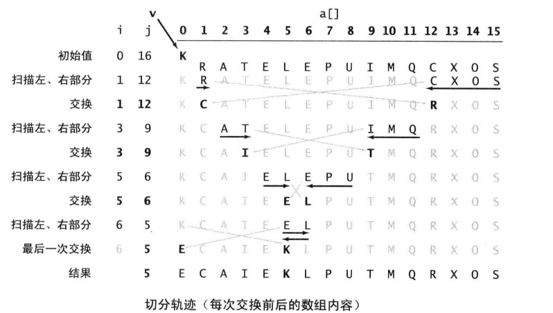

2018-09-18

## 快速排序

### 性质
1. 分治的排序算法
1. 寻找一个切入点, 
    - 大于切入点的在右边, 小于的在左边
    - 当两边都有序的时候, 整个数组也就自然有序了
2. 关键在于切分算法

### 切分算法
1. 直接选择lo为切入点
    - 从左边开始扫描, 直到找到一个大于等于它的元素, 
    - 在从右边来是扫描, 直到找到一个小于等于它的元素
    - 交换
    - 过程
        - 
2. 注意
    - 原地切分
        - 如果使用辅助数组, 开销更大
    - 别越界
        - 小心 切分元素是数组最小或者最大的元素
    - 保持随机性
    - 终止循环
    - 终止递归
        - 设置切分元素
    
        
    
