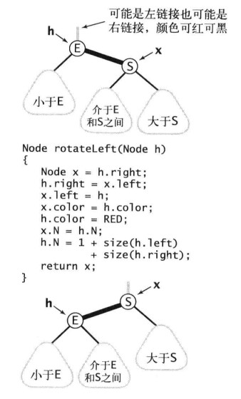
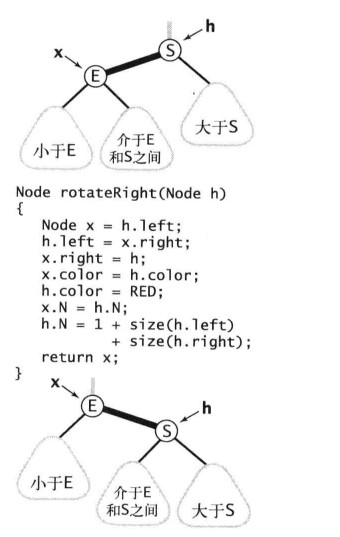

2018-08-30

## 平衡二叉树

### 特点
1. 是b-tree, BR-tree, AVL-tree的基础
2. 主要是防止树的左右两边高度相差太多
3. 查询性能和树的高度成反比
4. 保证最坏情况下的查询不至于太慢

### 红黑树
1. 红链接 均为 左链接
2. 没有任何一个节点同时和两条 红连接 相连
3. **完美黑色平衡**, 任意空链接到根节点的路径上的黑连接数量相同
4. **新插入节点应该是 红色, 如果不是红色 就会破坏 完美黑色平衡**

### 左旋转h的右连接

### 右旋转h的做左链接

### 颜色转换
1. 转为一个节点的连个红色子节点 **变黑**
2. 将当前节点的颜色 **变红**
    - 保证 完美黑色平衡

### 根节点总是黑色
1.每当根节点有红色变为黑色, 树的黑连接高度+1

### 将红连接在树中向上传递
1. 如果右子节点是红色  左子节点是黑色, 左旋转
2. 左子节点红色, 且它的左子节点也是红色, 右旋转
3. 如果左右节点都是红色, 颜色转换

### 删除

### 性质
1. 所有基于红黑树的符号表实现都能保证操作的运行时间为 对数级别
2. 