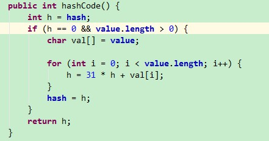

2018-09-01

## 散列表

### 概念
1. 查找算法
    - 使用 **散列函数** 将查找的键转化为数组的一个索引
    - 处理碰撞冲突
        - 拉链法, 线性探索法

### 散列函数
1. 易于计算 并且 **能够均匀分布所有的键**
2. 与 键的类型有关
    - 每一种类型的键都需要一个与之对应的散列函数
3. 例子
    - 正整数 
        - 除留余数法
        - 大小为**素数 M** 的数组
    - 浮点数
        - 乘以 M 并四舍五入得到一个 0-M之间的索引值  
            - 键的高位起的作用更大, 最低位对散列的结果没有影响
        - java: 将键表示为 二进制, 然后在使用除留余数法
    - 字符串
        - 
    - 将hashcode()的返回值转化为一个数组索引
        - (x.hashcode() & 0x7FFFFFFF) % M
            - 符号位屏蔽
            - 除留余数法
            
### 软缓存
1. 将每个键的散列值缓存起来(一个hash变量)

### 一个优秀的散列方法
1. 一致性: 等价的键必然产生相等的散列值
2. 高效性: 计算简单
3. 均匀性: 均匀的散列所有的键

### 基于拉链法的散列表
1. 数组中的每个元素指向一条链表
1. 查找: 根据散列值找到对应的链表, 然后沿着链表找到相应的键
1. 实现方法 
    - 动态调整整数组的大小以保持短小的链表
2. 散列表的大小

### 基于线性探测法的散列表
1. 用大小 M 的数组保存 N 个键值对 M>N, 依靠数组中的空位解决碰撞冲突 --> 开放地址散列表
2. 三种结果
    - 命中
    - 未命中, 该位置为空
    - 有键, 但不同, 继续+1查找
3. 并行数组: 一个保存键, 一个保存值
4. 删除
    - 不可以直接将该键所在的位置设为 null, **这样会造成后面的键 无法被查找**
    - 将这个键后面的所有键 重新插入散列表
5. 键簇
    - 平均成本取决于元素在插入数组后聚集成的一组连续的条目-->键簇|
6. 均摊分析
7. 内存使用

### 总结
1. 散列表并非是灵丹妙药
    - 每种类型键都需要一个优秀的散列函数
    - 性能保证来自于三两函数的质量
    - 散列函数的计算可能复杂而且昂贵
    - 难以支持 有序性 相关的符号表操作