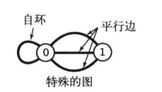
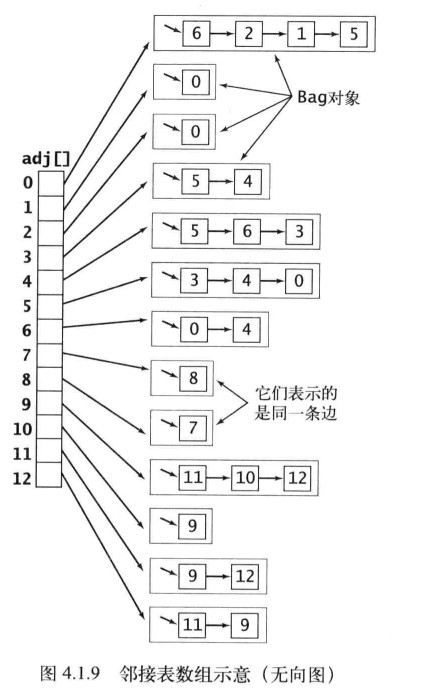

2018-09-02

## 无向图

### 定义
1. 图是由 一组顶点和一组能够将两个顶点相连的边组成的
2. 0 至 V-1表示一张含有V个顶点的图中的各个顶点
3. v-w表示连接v和w的边(w-v)

### 特殊的图

1. 自环: 一条连接自身的边
2. 平行边: 连接同一对顶点的多条边

### 术语
1. 路径: 由边顺序连接的一系列顶点
2. 简单路径: 一条没有重复顶点的路径
    - u-v-w-x: u到x的一条路径
3. 环: 是一条至少含有一条边并且 起点和终点 相同的路径
4. 简单环: 不含有重复顶点和边的环
    - u-v-w-x-u: 从u到x再回到u的一条环
5. 长度: 路径或者环所包含的边数
6. 一个顶点和另外一个顶点是连通的: 两个顶点之间存在一条连接双方的路径
7. 连通图: 从任意一个顶点都存在一条路径到达另一个任意顶点
8. 非连通图: 由若干连通的部分组成, 都是其极大连通子图
9. 无环图: 一种不包含环的图
10. 树: 一种无环连通图
11. 森林: 互不相连的树组成的集合

### 树与图的转换
1. 当且仅当 一副含有V个节点的图G满足下列5个条件之一时, 它就是一颗树
    - G 有 V-1 边, 不含有环
    - G 有 V-1 边, 连通的
    - G 是连通的, 且删除任意一条边都会使他不在连通
    - G 是无环图, 但 添加任意一条边都会产生一个环
    - G 中任意一堆顶点之间仅存在一条简单路径
    
### 对处理图的数据结构的要求
1. 必须为可能在应用中碰到的各种类型的图预留足够的空间
2. 要快

### 数据结构
1. 邻接矩阵
    - V * V 的布尔矩阵
    - 顶点 v 与 顶点 w 有相连接的边, 定义 (v,w) = true;
    - **上百万个顶点的图狠常见, V²个布尔值所需的空间不足**
    - **无法表示平行边**
2. 边的数组
    - Edge类, 包含2个int变量, 
    - **要实现 adj() 需要检查图中的所有的边**
3. 邻接表数组
    - 
    - 以顶点为索引的列表数组
    - 每个元素都是和该顶点相邻的顶点元素

### 邻接表的数据结构
1. 每条边出现两次
2. 使用的空间和 V+E 成正比
3. 添加一条边所需的时间为常数
4. 遍历顶点 v 的所有相邻节点所需的时间和 v 的度数成正比

### DFS(DeepFirstSearch)
1. 探索迷宫(试探与回溯)
    - 选择一条没有标记过的通道, 在走过的路上铺一条绳子
    - 标记所有第一次路过的路口与通道
    - 当来到一个标记过的路口时, 回退到上个路口
    - 当回退到的路口没有可走的通道继续回退
2. 探索连通图的递归算法
    - 访问其中一个顶点
        - 将他标记位已访问
        - 递归的访问他的所有没有被标记过的邻居节点
3. 解决
    - 两个给定的点是否连通
    - 单点路径

### 寻找路径
1. edgeTo[w] = v 的理解
    - index就是顶点, 对应的值就是 从起点到一个顶点已知路径上的最后一个顶点
    - 是一颗用父连接表示的以s为根且含有与s连通的顶点的数
2. 得到的路径
    - 取决于 图的结构
    - 图的表示
    - 递归调用的性质
    
### 广度优先搜索(BFS) --> 最短路径
1. 实现
    - FIFO
    - 使用一个队列保存所有已被标记过但是其相邻表还未被检查过的顶点
    - 先将起点加入队列
    - 取队列的下一个顶点v并标记他
    - 将于v相邻的所有未被标记的顶点加入队列
    - 如何确定bfs是最短路径
        - 根据FIFO队列的特性, 首先进入队列的就是离起点最近的顶点
        - 已标记被访问的顶点, 其他的顶点只能被之后访问的时候标记
2. VS DFS
    - 深度优先搜索不断深入图中并在栈中保存了所有分叉的节点; 广度优先搜索则向扇面一般扫描图, 用队列保存访问过的最前端的点
    - DFS的探索一张图的方式是 寻找里起点最远的点, 只有碰到死胡同才会访问近处的顶点; BFS会首先覆盖起点附近的顶点, 只有临近的起点
    被全部访问之后, 才会前进
    - DFS 的路径通常较长而且曲折; BFS 的路径则 短而直接  
    
### 连通分量
1. 实现
    - marked[]
    - id[]
        - 顶点为索引, 值-->连接分量的标识符
        - 同一个连接分量的顶点的标识符是一致的
    - count
        - 连接分量标识符
    - 这种用顶点作为索引, 所需内容作为值的思想666...
    
### union-find 算法
1. 动态连通性
    - 
    