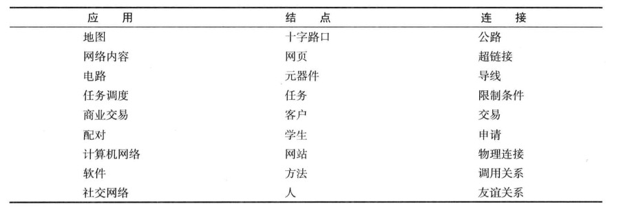

2018-09-02

## 示例

1. 地图
    - 最短路线
    - 最近路线
2. 网页信息
    - 真个互联网就是一张图, 节点是网页, 连接是 超链接
3. 电路
4. 任务调度
    - 在满足限制条件的情况下, 用最小的时间完成这些生产工序
5. 商业交易
6. 配对
7. 计算机网络
8. 软件
9. 社交网络
    - 分析社交网络的性质
    
## 图模型
1. 无向图
    - 简单连接
2. 有向图
    - 连接有方向性
3. 加权图
    - 连接带有权值
4. 加权有向图
    - 连接既有方向也有权值