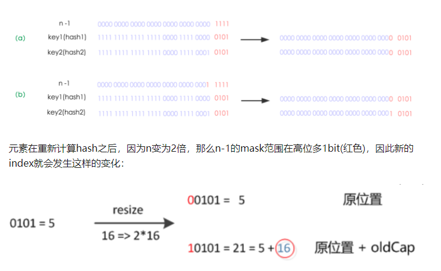
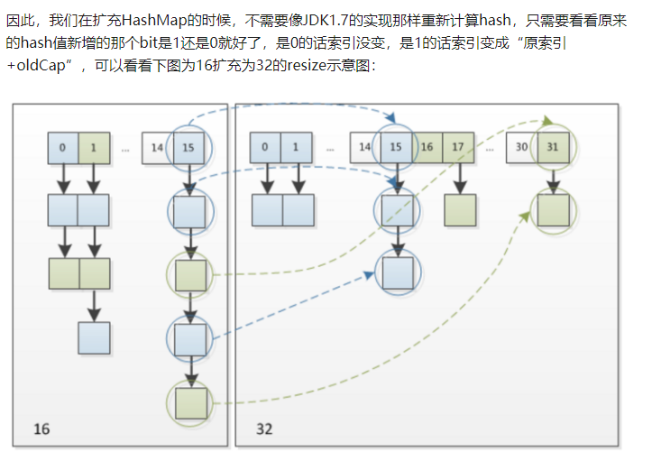

2018-09-24

## 扩容

### jdk1.7
1. 在将旧数组上的数据 转移到 新数组上时, 
    - **转移数据操作 = 按旧链表的正序遍历链表、在新链表的头部依次插入，
    - 即在转移数据、扩容后，容易出现链表逆序的情况**
2. 此时若（多线程）并发执行 put（）操作，一旦出现扩容情况，则 **容易出现 环形链表**
3. **从而在获取数据、遍历链表时 形成死循环**

### jdk1.8
1. 转移数据操作 =
    - 按旧链表的逆序遍历链表 
    - 在新链表的头部依次插入，
    - 所以不会出现链表 逆序、倒置的情况，故不容易出现环形链表的情况。**
    - 如果 多个key hash 后index仍然一样, node的前后顺序不变, 就是可能中间 或两边没有了
2. **只是不容易出现罢了**

### jdk8 扩容
1. **我们在扩充HashMap的时候，不需要像JDK1.7的实现那样重新计算hash，
    只需要看看原来的hash值新增的那个bit是1还是0就好了，是0的话索引没变，是1的话索引变成“原索引+oldCap”**

