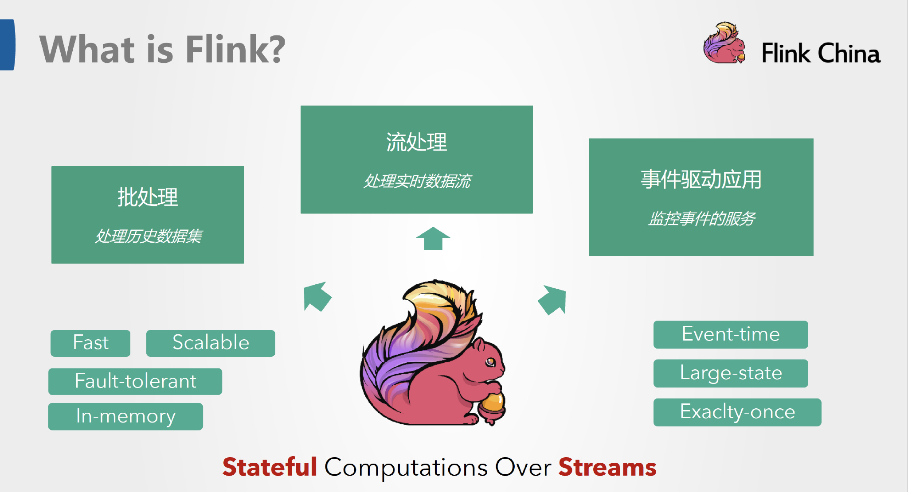

2019-03-27

## 介绍
1. http://www.54tianzhisheng.cn/2018/10/13/flink-introduction/

### 数据集类型
1. 无穷数据集
    - 无穷的持续集成的数据集合
    - 比如
        - 用户和客户端的实时交互数据
        - 应用实时产生的日志
        - 实时交易日志
2. 有界数据集
    - 有序的不会改变的数据集合

### 数据运算模型
1. 流式
    - 只要数据一产生, 计算就持续的进行
2. 批处理
    - 在预先定义的时间内进行运算, 当完成时释放 计算机资源
    

### Flink 的 基石
1. CheckPoint
    - 基于 Chandy-Lamport 算法, 实现分布式一致性快照, 提供一致性的语义
2. State
    - 丰富的 State api
    - ValueState, ListState, MapState, BroadcastState
3. Time
    - 实现 Watermark 机制, 乱序数据处理, 迟到数据容忍
4. windon  
    - 开箱即用的滚动, 滑动, 回话窗口
    - 灵活的自定义窗口
    
### Flink 整体结构

1. 部署：Flink 支持本地运行、能在独立集群或者在被 YARN 或 Mesos 管理的集群上运行， 也能部署在云上。
2. 运行：Flink 的核心是分布式流式数据引擎，意味着数据以一次一个事件的形式被处理。
3. API：DataStream、DataSet、Table、SQL API。
4. 扩展库：Flink 还包括用于复杂事件处理，机器学习，图形处理和 Apache Storm 兼容性的专用代码库。

### Flink 程序与数据流结构

1. Source: 数据源，Flink 在流处理和批处理上的 source 大概有 4 类：
    - 基于本地集合的 source、基于文件的 source、基于网络套接字的 source、自定义的 source。
    - 自定义的 source 常见的有 Apache kafka、Amazon Kinesis Streams、RabbitMQ、Twitter Streaming API、Apache NiFi 等，
    - 当然你也可以定义自己的 source。
2. Transformation：数据转换的各种操作，
    - 有 Map / FlatMap / Filter / KeyBy / Reduce / Fold / Aggregations / Window / WindowAll / Union 
        / Window join / Split / Select / Project 等，
    - 操作很多，可以将数据转换计算成你想要的数据。
3. Sink：接收器，Flink 将转换计算后的数据发送的地点 ，你可能需要存储下来，Flink 常见的 Sink 大概有如下几类：
    - 写入文件、打印出来、写入 socket 、自定义的 sink 。
    - 自定义的 sink 常见的有 Apache kafka、RabbitMQ、MySQL、ElasticSearch、Apache Cassandra、Hadoop FileSystem 等，
    - 同理你也可以定义自己的 sink。
    
### 为什么选择 Flink?
1. TODO