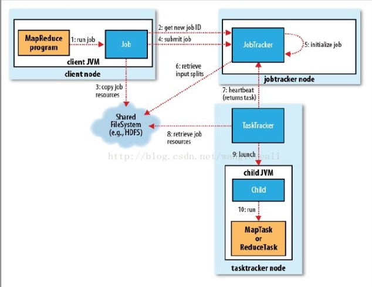
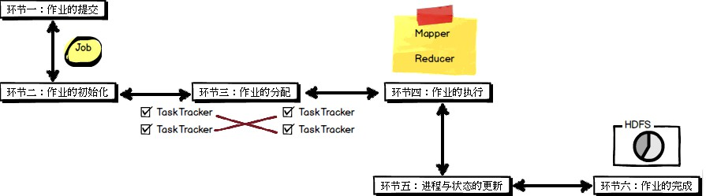
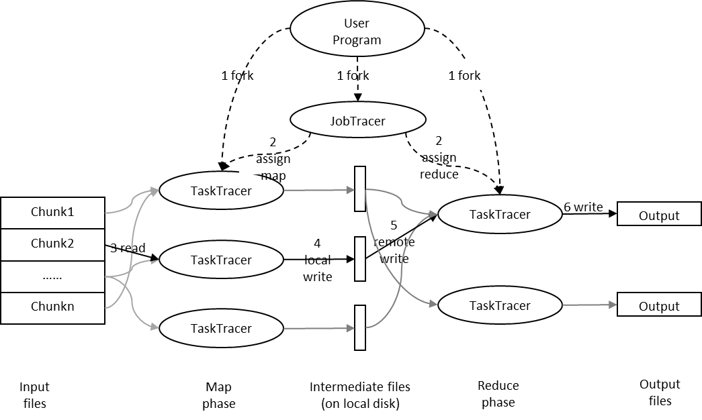
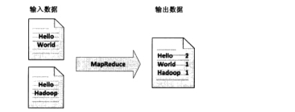
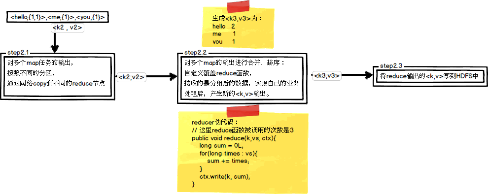

2019-04-04

## MapReduce

### 是什么
1. Hadoop MapReduce 是一个软件框架, 
2. 基于该框架能够容易的编写应用程序, 
3. 应用程序能够运行由上千个机器组成的大集群中
4. 并以一种可靠的, 具有容错能力的方式 并行 的处理 TB级别的海量数据集
5. **软件框架, 并行处理, 可靠且容错, 大规模集群, 海量数据集**

### 做什么
1. 分而治之
2.  Mapper 复杂的任务分解为若干个“简单的任务”来处理
    - **数据或计算的规模相对原任务要大大缩小**
    - **二是就近计算原则**
    - 这些小任务可以并行计算，彼此间几乎没有依赖关系。
3. Reduce 
    - 负责对map阶段的**结果进行汇总**
    
### 工作机制

1. 客户端: 提交 MapReduce 作业
2. JobTracker: 协调作业运行
3. TaskTracker: 处理作业划分后的任务
4. HDFS: 用来在其它实体间共享作业文件。

### Hadoop 中的 MapReduce 框架
1. 一个MapReduce作业通常会把输入的数据集切分为若干独立的数据块，由Map任务以完全并行的方式去处理它们。
2. 框架会对Map的输出先进行排序，然后把结果输入给Reduce任务。
3. 通常作业的输入和输出都会被存储在文件系统中，整个框架负责任务的调度和监控，以及重新执行已经关闭的任务。
4. 通常，**MapReduce框架和分布式文件系统是运行在一组相同的节点上，也就是说，计算节点和存储节点通常都是在一起的。**
    - 这种配置允许框架在那些已经存好数据的节点上高效地调度任务，这可以使得整个集群的网络带宽被非常高效地利用。
    
### MapReducer 框架的组成

### MapReduce的处理流程
1. 例子
    -
    

2. map
    - 
    

3. reduce
    - 
    
