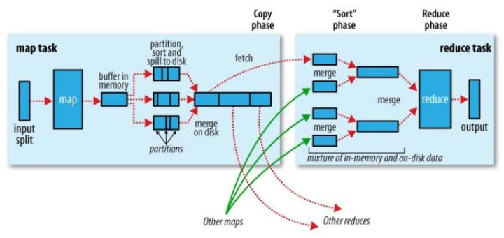

2019-04-23

## Hadoop vs Spark

### Hadoop 解决了什么问题
1. 大数据(大到单台计算机无法进行存储, 无法在要求的时间内处理) 的 **可靠存储和处理**
2. 实现
    - HDFS
        - 普通PC组成集群提供可靠的文件存储
        - 通过保存多个副本的办法解决服务器和硬盘坏掉的问题
    - MapReduce
        - 对 Mapper, Reducer 的抽象提供一个编程模型
        - 在大量PC组成的不可靠集群上并发的, 分布式的处理大量的数据集
        - 把 并发, 分布式(如机器通信), 故障恢复细节隐藏
        - **复杂的数据处理分解为多个job(包含一个 Mapper 一个 Reduce) 组成的有向无环图(DAG)**
        - 让后 将 每个Mapper 和 Reduce 放到 Hadoop集群上执行
        - 然后 得出结果
    - 过程
        - 广义的Shuffle是指图中在Map和Reuce之间的一系列过程。
        -
        

3. MapRecue 不足和局限
    - 抽象层次低, 需要手工编写代码来完成
    - 只有 Map, Reduce
    - **一个 Job 只有 Map, Reduce 两个阶段(Phase), 复杂计算需要大量的Job完成, Job之间的依赖需要自行维护** 
    - 中间结果也放在HDFS文件系统中
    - **ReduceTask 需要等待所有 MapTask 都完成之后才可以开始**
    - 时延高, 只适用Batch 数据处理, 
        - 因为 数据先放入 HDFS
    - 