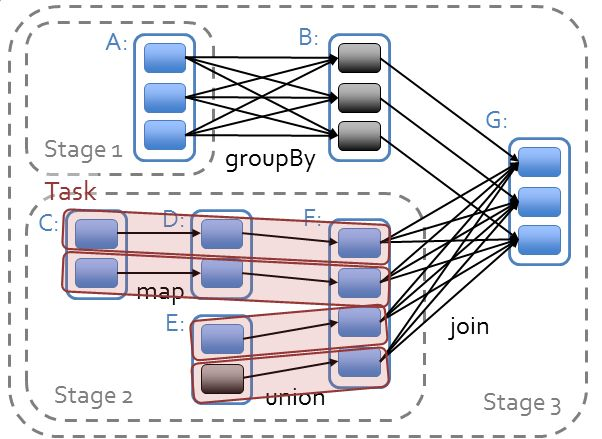

2019-04-23

## Hadoop vs Spark

### Hadoop 解决了什么问题
1. 大数据(大到单台计算机无法进行存储, 无法在要求的时间内处理) 的 **可靠存储和处理**
2. 实现
    - HDFS
        - 普通PC组成集群提供可靠的文件存储
        - 通过保存多个副本的办法解决服务器和硬盘坏掉的问题
    - MapReduce
        - 对 Mapper, Reducer 的抽象提供一个编程模型
        - 在大量PC组成的不可靠集群上并发的, 分布式的处理大量的数据集
        - 把 并发, 分布式(如机器通信), 故障恢复细节隐藏
        - **复杂的数据处理分解为多个job(包含一个 Mapper 一个 Reduce) 组成的有向无环图(DAG)**
        - 让后 将 每个Mapper 和 Reduce 放到 Hadoop集群上执行
        - 然后 得出结果
    - 过程
        - 广义的Shuffle是指图中在Map和Reuce之间的一系列过程。
        -
        

3. MapRecue 不足和局限
    - 抽象层次低, 需要手工编写代码来完成
    - 只有 Map, Reduce
    - **一个 Job 只有 Map, Reduce 两个阶段(Phase), 复杂计算需要大量的Job完成, Job之间的依赖需要自行维护** 
    - 中间结果也放在HDFS文件系统中
    - **ReduceTask 需要等待所有 MapTask 都完成之后才可以开始**
    - 时延高, 只适用Batch 数据处理, 
        - 因为 数据先放入 HDFS
    - 对交互式数据, 实时数据处理的支持不够
    - 

### Apache Pig
1. Hadoop 架构的一部分
2. **提供类 SQL语言通过 MapReduce来处理大规模半结构化数据**
3. 通过将MapReduce中的设计模式抽象为操作，如Filter，GroupBy，Join，OrderBy，由这些操作组成 有向无环图 (DAG)
4. 解决 MapReduce存在的大量手写代码, 语义隐藏  

### Apache Spark
1. 提供一个集群的分布式内存抽象, 以支持 需要工作集的应用 --> RDD
2. Resilient Distributed Dataset
    - **一个不可变的带分区的记录集合**
    - Spark的编程模型
    - 提供两类操作
        - 转换 --> 定义一个新的 RDD
            - map
            - flatmap
            - filter
            - union
            - sample
            - join
            - groupByKey
            - ReduceByKey
            - sortByKey
            - ...
        - 动作 --> 返回一个结果
            - collect
            - reduce
            - count
            - save
            - lookupKey
2. 实例
    ```javascript
    val spark = new SparkContext(master, appName, [sparkHome], [jars])
    val file = spark.textFile("hdfs://...")
    val counts = file.flatMap(line => line.split(" "))
                    .map(word => (word, 1))
                    .reduceByKey(_ + _)
    counts.saveAsTextFile("hdfs://...")
    ```
    ```javascript
    scala> counts.toDebugString
    res0: String =
        MapPartitionsRDD[7] at reduceByKey at <console>:14 (1 partitions)
            ShuffledRDD[6] at reduceByKey at <console>:14 (1 partitions)
                MapPartitionsRDD[5] at reduceByKey at <console>:14 (1 partitions)
                    MappedRDD[4] at map at <console>:14 (1 partitions)
                        FlatMappedRDD[3] at flatMap at <console>:14 (1 partitions)
                            MappedRDD[1] at textFile at <console>:12 (1 partitions)
                                HadoopRDD[0] at textFile at <console>:12 (1 partitions)
    ```
    
    - file 会根据HDFS上的文件创建RDD, 
    - 后面的 flapmap **都创建一个新的RDD**
    - 在Spark中，所有RDD的转换都是是惰性求值的
    - RDD的转换操作会生成新的RDD, 新的RDD的数据依赖于原来的 RDD, 每个RDD又包含多个分区
    - 各种转换在实际上构造了一个由相互依赖的多个RDD 组成的有向无环图 DAG, 
    - **并通过在RDD上执行动作将这个有向无环图最为一个job提交到 spark 执行**

3. job调度
    - 确定阶段(Stage), 分区 Partition, 流水线 Pipeline, 任务 Task, 缓存 Cache
    - 
    
    
    - TODO

4. 故障恢复
    - Linage
        - **通过数据的血缘关系, 在执行一遍前面的处理**
    - Checkpoint
        - **将数据集存储到持久层中**
5. Spark为迭代式数据处理提供更好的支持。
    - **每次迭代的数据可以保存在内存中，而不是写入文件。**
    
### Spark 解决了Hadoop的那些问题
1. 抽象层次低, 需要手工编写代码来完成
    - 基于 RDD, 实际数据处理逻辑代码很简短
1. 只有 Map, Reduce
    - 基于RDD, 提供很多转换和动作
1. **一个 Job 只有 Map, Reduce 两个阶段(Phase), 复杂计算需要大量的Job完成, Job之间的依赖需要自行维护** 
    - 一个job可以包含RDD的多种转换和动作, 
    - 在调度时可以生成过多个阶段
    - 如果 多个MAP 调用的 RDD 不变,  是可以放到同一个 Task 执行
1. 中间结果也放在HDFS文件系统中
    - 中间结果放入内存, 内存不足写入磁盘
1. **ReduceTask 需要等待所有 MapTask 都完成之后才可以开始**
    - 分区相同的转换构成流水线非放在一个 task 执行, 
    - **分区不同的转换, 需要 shuffle, 被划分到不同的stage中, 需要等待前面的stage 都完成后才可以开始**
1. 时延高, 只适用Batch 数据处理, 
    - 通过将流拆成小的batch提供Discretized Stream处理流数据。
1. 对交互式数据, 实时数据处理的支持不够
    - 通过在内存中缓存数据，提高迭代式计算的性能。

    