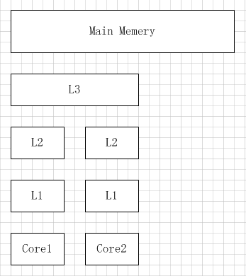

2019-03-03

## 伪共享

### 说明
1. 缓存系统中是以缓存行（cache line）为单位存储的，
    当多线程修改互相独立的变量时，**如果这些变量共享同一个缓存行**，就会无意中影响彼此的性能，这就是伪共享

### cpu缓存
1. 按照数据读取顺序和与 CPU 结合的紧密程度，CPU 缓存可以分为一级缓存，二级缓存，部分高端 CPU 还具有三级缓存
2. 当 CPU 执行运算的时候，它先去 L1 查找所需的数据，再去 L2，然后是 L3，最后如果这些缓存中都没有，所需的数据就要去主内存拿

    
    
### MESI 协议及 RFO 请求
1. 那么多线程编程时, 另外一个核的线程想要访问当前核内 L1、L2 缓存行的数据, 该怎么办呢？ 
    - 如果第 2 个核需要这份数据，由第 1 个核直接把数据内容发过去，数据只需要传一次。
2. 那么什么时候会发生缓存行的传输呢
    - 当一个核需要读取另外一个核的脏缓存行时发生
3. 前者怎么判断后者的缓存行已经被弄脏(写)了呢？
    - MESI 协议 : 来保证缓存的相干性和内存的相干性
        - M(Modified): 本地处理器已经修改缓存行，即是脏行，它的内容与内存中的内容不一样，并且此 cache 只有本地一个拷贝(专有)； 
        - E(专有，Exclusive)：缓存行内容和内存中的一样，而且其它处理器都没有这行数据；
        - S(共享，Shared)：缓存行内容和内存中的一样, 有可能其它处理器也存在此缓存行的拷贝；
        - I(无效，Invalid)：缓存行失效, 不能使用。
    - 四个状态是如何转换的：
        - 初始：
            - 一开始时，缓存行没有加载任何数据，所以它处于 I 状态。
        - 本地写（Local Write）：
            - 如果本地处理器写数据至处于 I 状态的缓存行，则缓存行的状态变成 M。
        - 本地读（Local Read）：
            - 如果本地处理器读取处于 I 状态的缓存行，很明显此缓存没有数据给它。此时分两种情况：
                - 其它处理器的缓存里也没有此行数据，则从内存加载数据到此缓存行后，再将它设成 E 状态，
                    表示只有我一家有这条数据，其它处理器都没有；
                - 其它处理器的缓存有此行数据，则将此缓存行的状态设为 S 状态。
                    （备注：如果处于M状态的缓存行，再由本地处理器写入/读出，状态是不会改变的）
        - 远程读（Remote Read）：
            - 假设我们有两个处理器 c1 和 c2，如果 c2 需要读另外一个处理器 c1 的缓存行内容，
            - c1 需要把它缓存行的内容通过内存控制器 (Memory Controller) 发送给 c2，
            - c2 接到后将相应的缓存行状态设为 S。
                - 在设置之前，内存也得从总线上得到这份数据并保存。
        - 远程写（Remote Write）：
            - 其实确切地说不是远程写，而是 c2 得到 c1 的数据后，不是为了读，而是为了写。
            - 也算是本地写，只是 c1 也拥有这份数据的拷贝，这该怎么办呢？
            - c2 将发出一个 RFO (Request For Owner) 请求，它需要拥有这行数据的权限，其它处理器的相应缓存行设为 I，
            - 除了它自已，谁不能动这行数据。
            - 这保证了数据的安全，同时处理 RFO 请求以及设置I的过程将给写操作带来很大的性能消耗。

### 缓存行
1. 缓存系统中是以缓存行（cache line）为单位存储的。
2. 缓存行通常是 64 字节

### Disruptor 项目的经典示例图

    
1. 一个运行在处理器 core1上的线程想要更新变量 X 的值，同时另外一个运行在处理器 core2 上的线程想要更新变量 Y 的值。
2. 但是，这两个频繁改动的变量都处于同一条缓存行。
3. 两个线程就会轮番发送 RFO 消息，占得此缓存行的拥有权。
4. 当 core1 取得了拥有权开始更新 X，则 core2 对应的缓存行需要设为 I 状态。
5. 当 core2 取得了拥有权开始更新 Y，则 core1 对应的缓存行需要设为 I 状态(失效态)。
6. 轮番夺取拥有权不但带来大量的 RFO 消息，而且如果某个线程需要读此行数据时，L1 和 L2 缓存上都是失效数据，只有 L3 缓存上是同步好的数据。
7. ，读 L3 的数据非常影响性能。更坏的情况是跨槽读取，L3 都要 miss，只能从内存上加载。
8. 表面上 X 和 Y 都是被独立线程操作的，而且两操作之间也没有任何关系。只不过它们共享了一个缓存行，但所有竞争冲突都是来源于共享。
    