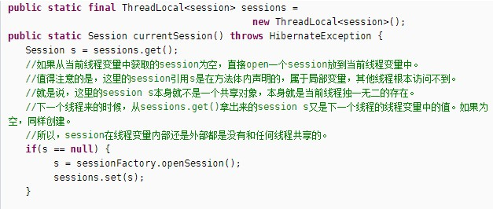

2017-11-15
### 理解
1. ThreadLocal 内部是用数组实现的,数组中的成员是Entry,此Entry继承了WeakReference
2. ThreadLocal有一个静态内部类 ThreadLocalMap
3. 当ThreadLocal调用get方法的时候,首先获取当前线程对象,然后获取当前线程的ThreadLocalMap成员变量,
    通过ThreadLocal引用本身作为key, 获取当前ThreadLocal对象threadLocalHashCode,取模,获取数组下标,
    若果当前Entry的key==ThreadLocal就返回,如果不等,从当前下标往数组末尾查找,到数组末尾后,从0开始,还没有的话就创建并返回
    

		
### 优点(什么时候使用)
1. 当对象不是线程安全的,并且不想加锁的时候
2. ThreadLocal会为每一个线程提供一个独立的变量副本，从而隔离了多个线程对数据的访问冲突
3. 时间换空间?? --> 空间换时间
	
### 缺点
1. 内存泄漏:
    - ThreadLocalMap 使用ThreadLocal的弱引用作为key，
    - 如果一个ThreadLocal没有外部强引用来引用它，那么系统 GC 的时候，这个ThreadLocal势必会被回收，
    - 这样一来，ThreadLocalMap中就会出现key为null的Entry，
    - 就没有办法访问这些key为null的Entry的value，如果当前线程再迟迟不结束的话，
    - 这些key为null的Entry的value就会一直存在一条强引用链：
    - Thread Ref -> Thread -> ThreaLocalMap -> Entry -> value永远无法回收，造成内存泄漏.
    - 其实，ThreadLocalMap的设计中已经考虑到这种情况，也加上了一些防护措施：
    - 在ThreadLocal的get(),set(),remove()的时候都会清除线程ThreadLocalMap里所有key为null的value
    - 但是这些被动的预防措施并不能保证不会内存泄漏：
    - 使用static的ThreadLocal，延长了ThreadLocal的生命周期，可能导致的内存泄漏
    - 分配使用了ThreadLocal又不再调用get(),set(),remove()方法，那么就会导致内存泄漏。
    - (http://blog.xiaohansong.com/2016/08/06/ThreadLocal-memory-leak/)
    
### 为什么使用弱引用
1. 官方文档
    - 为了应对非常大和长时间的用途，哈希表使用弱引用的 key
2. 使用强引用
    - 引用的 ThreadLocal要被回收, ThreadLocalMap 还持有 ThreadLocal 的强引用, 无法被回收, Entry 内存泄漏
3. 使用弱引用
    - ThreadLocal 将要被回收, ThreadLocalMap 持有 ThreadLocal 的弱引用, 及时没有手动删除, 也会被回收
    - value 在下一次调用 get set remove 被回收
4. 比较
    - **由于 ThreadLocalMap 和 Thread 的生命周期 一样长, 如果没有手动删除对应的key 就会造成内存泄漏**
    - **而不是因为 弱引用**
    - **弱引用 只是增加一层保障**

### 线程安全
1. ThreadLocal 并**不是用来解决线程安全**的
2. 存放到 ThreadLocal 的变量是当前线程本身就独一无二的变量
       

### get
1. 获取当前线程对象
2. 根据当前线程对象获取 ThreadLocalMap
    - 一个数组
    - 每一个线程对象 会有 多个 ThreadLocal
3. ThreadLocalMap.get(this)
    - threadLocalHashCode
        - 有一个基数
        - 每新建一个 ThreadLocal 都会递增
    - this.threadLocalHashCode % (table.length -1)
    - entry != null and entry.key = this

### 最佳实践
1. 每次使用完ThreadLocal，都调用它的remove()方法，清除数据。

		