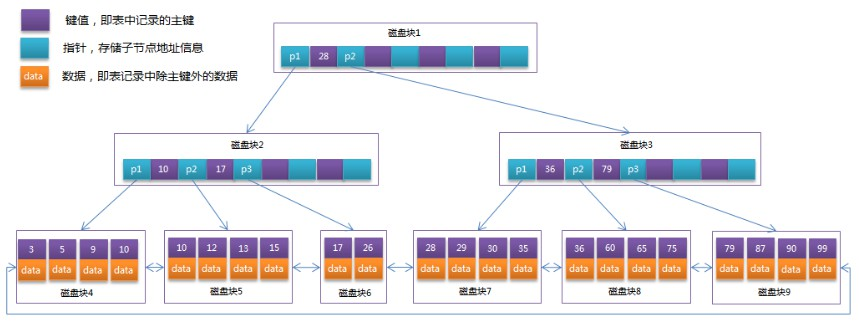

2018-09-13

## B+Tree

### VS B-tree
1. B-Tree每个节点不仅包含了数据的key , 还包含了data, 但是每一个页的存储空间时有限的, data大导致每个节点存储的key数量小,
    当存储量较大的时候, 就会造成B-Tree深度较大, 增加查询的磁盘IO次数
    - B-Tree无法有效的进行范围查询
2. 在B+Tree中, 数据记录节点按照键值大小顺序存放在同一层的叶子节点上, 非叶子节点只存储key值信息
    大大增加key可存储数量, 降低B+Tree的高度
    - 有利于范围查询
3. 总结(b+Tree)
    - 非叶子节点只存储键值信息。
    - 所有叶子节点之间都有一个链指针。
    - 数据记录都存放在叶子节点中

### B+Tree结构图
 

### B+Tree 特点
1. 两个头指针, 一个指向根节点, 一个指向关键字的最小节点
2. 所有的叶子节点(数据节点) 是一种链式结构
3. 方便两种查找运算
    - 对于主键的范围查找以及分页查找
    - 从根节点开始的 随机查找

### 应用
1. 更适合外部存储索引结构
2. InnoDB

### InnoDB中的B+tree
1. 高度一般为2-4层
2. 根节点常驻内存
3. 查找某一个键值的行记录需要1-3次的磁盘IO

### 聚集索引 辅助索引
1. 上面的B+Tree示例图在数据库中的实现即为聚集索引，聚集索引的B+Tree中的叶子节点存放的是整张表的行记录数据。
2. 辅助索引与聚集索引的区别在于辅助索引的叶子节点并不包含行记录的全部数据，**而是存储相应行数据的聚集索引键，即主键**
3. 当通过辅助索引来查询数据时，InnoDB存储引擎会遍历辅助索引找到主键，然后再通过主键在聚集索引中找到完整的行记录数据

### B+
1. 所有的叶子结点中包含了全部关键字的信息，及指向含有这些关键字记录的指针，且叶子结点本身依关键字的大小自小而大的顺序链接。 (而B 树的叶子节点并没有包括全部需要查找的信息)
2. 所有的非终端结点可以看成是索引部分，结点中仅含有其子树根结点中最大（或最小）关键字。 (而B 树的非终节点也包含需要查找的有效信息)

### B+-tree比B 树更适合实际应用中操作系统的文件索引和数据库索引
1. B+-tree的内部结点并没有指向关键字具体信息的指针。因此其内部结点相对B 树更小。如果把所有同一内部结点的关键字存放在同一盘块中，
那么盘块所能容纳的关键字数量也越多。一次性读入内存中的需要查找的关键字也就越多。相对来说IO读写次数也就降低了
2. 由于非终结点并不是最终指向文件内容的结点，而只是叶子结点中关键字的索引。所以任何关键字的查找必须走一条从根结点到叶子结点的路。所有关键字查询的路径长度相同，导致每一个数据的查询效率相当。
3. **B+树只要遍历叶子节点就可以实现整棵树的遍历。而且在数据库中基于范围的查询是非常频繁的，而B树不支持这样的操作（或者说效率太低）*