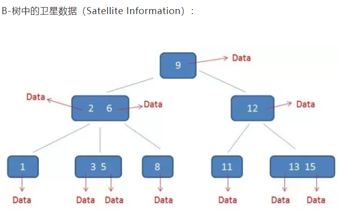
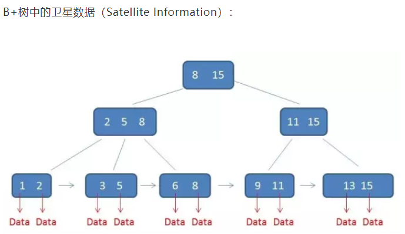

2019-08-11

## BTree vs B+Tree

### 单一节点存储更多的元素，B+Tree使得查询的IO次数更少。
1. BTree
    - 节点里面的元素不重复
    - 无论中间节点还是叶子节点都会带有 卫星数据
    - 导致同样的 磁盘页 只可以放入更少的节点
    - 同样的数据量, 树更高
2. B+Tree
    - 每一个父节点的元素都出现在子节点, 是子节点的最大(或最小)元素
    - 只有叶子节点 的 指针 指向数据的存储位置
    

### 所有查询都要查找到叶子节点，查询性能稳定
1. 查询流程差不多
1. BTree
    - 同一个磁盘页可以容纳更多数据
    - BTree 只要找到匹配的元素即可
    - 查找性能不稳定, 最好:根节点, 最差: 叶子节点
2. B+tree
    - 查询必须最终查照到叶子节点
    - 相同的数据量, B+tree 比 BTree 更加的 矮胖
    - 因此 查询的IO次数 也更少
    

### 所有叶子节点形成有序链表，便于范围查询。
1. BTree
    - 范围查找, 需要 自顶向下, 
    - 中序遍历
    - 可能会回到树顶
2. B+tree
    - 自顶向下
    - **链表遍历**