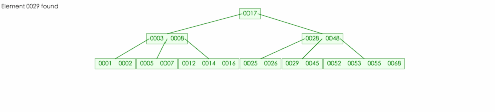
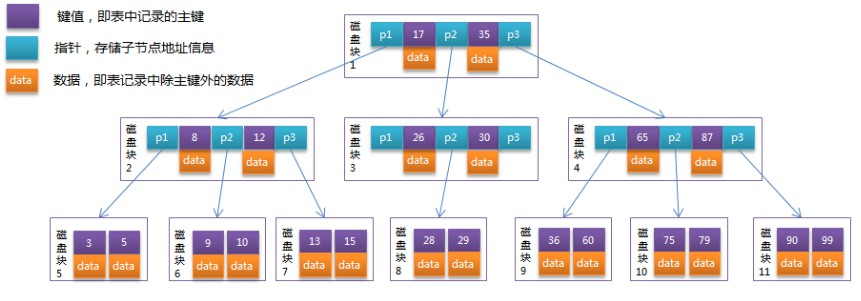

2018-09-12

## B-Tree

### 概念
1. 多路平衡查找树
2. 每一个节点最多包含 K 个孩子, K 被称为B树的阶. **K 的大小取决于磁盘页的大小**

### 特征
1. 根结点至少有两个子女。
2. 每个中间节点都包含k-1个元素和k个孩子，其中 m/2 <= k <= m
3. 每一个叶子节点都包含k-1个元素，其中 m/2 <= k <= m
4. 所有的叶子结点都位于同一层。
5. 每个节点中的元素从小到大排列，节点当中k-1个元素正好是k个孩子包含的元素的值域分划。

### 其他特征
1. (n,P0,K0,P1,K1,P2,···,Kn-1,Pn)
    - K[i] (i=0,···,n-1)为关键字, 一切`K[i] < K[i+1](i=0,···,n-1)`
    - [i] (i=0,1,···,n-1)为指向子树根结点的指针,  
    - 且指针P[i]所指向的子树中的所有结点的关键字均小于K[i] (i=0,···,n-1), P[i+1]所指向的子树中的所有结点的关键字均大于K[i]

### 操作
1. 查找
    - 在一棵 5 阶B-树中查找元素 29
        
    - 同样在该树查找一个不存在元素 54
        
2. 插入
    - 如果该节点的元素个数还没达到 m，则插入完后无需处理
        - 在 B-树中插入元素 3
            
    - 如果该节点元素个数达到 m 时，这时候将元素插入到合适的位置，将最中间的元素取出，成为该节点的父节点元素，然后将其余左右元素拆成两个新节
        - 在 B-树中插入元素 44
            
    - 刚才的操作可能导致父节点的元素个数达到 m，这时候用情况 2 迭代处理，直到如果遇到根结点元素个数达到 m，则最中间元素将成为新的根结点
        - 在 B-树中插入元素 45
            
3. 删除元素
    - 如果该元素存在于叶子结点，直接删除它，无需进行其它处理。
        
    - 如果该元素存在于非叶子节点，那么删除它将会留下一个空位，这时候我们需要一些处理来填充该位置
        - 如果被删除元素的左子树拥有足够的元素, 只需要拿左子节点的最大值上来填充
            - 在 B-树中删除元素 23
                  
        - 当左子树不够, 右子树充足的时候, 拿右子树的最小值来填充
            - 在 B-树中删除元素 35
                  
        - 当左右子树所含元素均不足时，但左子树的左边兄弟节点的元素个数充足，这时我们需要拿左边的兄弟节点来进行调整。
        
        - 当左右子树所含元素均不足时，但左子树的左边兄弟节点的元素个数也不足时，这时候我们还是拿左子树的最大值元素进行填充，
            之后再将该节点与其他节点合并形成新的节点。
            - 在 B-树中删除元素 40
                  
    - 其他删除情景
        - TODO
        
### 磁盘
1. B-Tree中的每个节点根据实际情况可以包含大量的关键字信息和分支，如下图所示为一个3阶的B-Tree
    
2. 
        
### 最大容纳量计算
1. 假设这是有棵 m 阶 B-树，则每层所能容纳最多元素个数为：
    - 根节点: m - 1
    - level1: m(m - 1)
    - level2: m^2(m - 1)
    - ...
    - leveln: m^n(m - 1)
2. 因此一棵树高为 h 的 B-树最多能容纳的元素为 m^(h + 1) - 1 即(将上面式子相加, 等比数列)
3. 一课 5 阶 B-树的高度为 2，则该树所能容纳最多元素个数为 5^3 - 1 = 124

### B-Tree应用
1. MongoDB
    - TODO