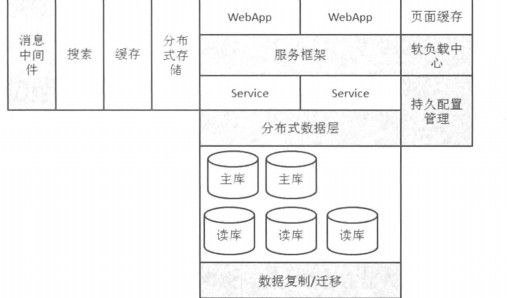

2019-01-10

## Java中间件

### 概念
1. 不是操作系统的一部分
2. 不是数据库, 软件应用的一部分
3. 能够让开发者方便的处理通信, 输入与输出, 专注自己的应用

### 三个领域的中间件
1. 远程过程调用和对象访问中间件
    - 分布式环境下应用的互相访问问题
2. 消息中间件
    - 解决应用之间的消息传递, 解耦, 异步的问题
3. 数据访问中间件
    - 解决应用访问数据库的共享问题的组件
    
### 
