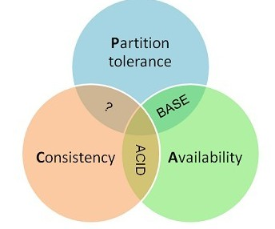

2018-03-09

### CAP理论概述
1. 一个分布式系统最多只能同时满足一致性（Consistency）、可用性（Availability）和分区容错性（Partition 
    tolerance）这三项中的两项。
2. 网络分区
    - 在分布式系统中, 节点组成网络, 
    - 因为网络故障, 使得节点不连通, 整个网络就分成了几块区域
    - 数据散布在这些不连通的区域中
    - 当一个数据只在这个节点中保存, 分区出现后, 和这个节点不连通的部分就访问不到这个数据, 此时 分区是无法容忍的
3. 提高分区容忍性
    - 一个数据复制到多个节点上, 出现分区后, 这个数据就可能分布到其他分区里, 提高了容忍性
    - 把数据复制到多个节点, 就会带来一致性的问题
4. 保持一致性
    - 每次写操作都要等待所有节点写成功, 这个等待 又会带来可用性的问题
5. 总结
    - **数据节点越多, 分区容忍性越高, 但是复制更新的数据越多, 一致性就越难保证, 为了保持一致性, 更新所有节点所需要的
        时间越长, 可用性就会降低**

###   
