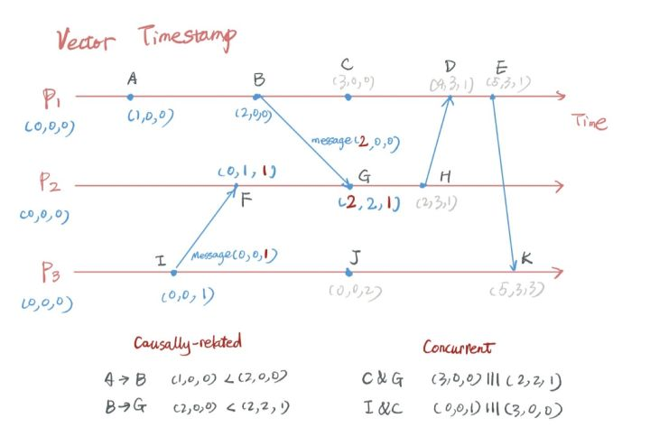

2019-03-14

## 全局时钟

### 为什么不能用系统时钟
1. 节点之间无法很好的明确同步
2. 硬件会发生时间漂移
3. 同步的时候取决于 带宽, 当时的拥塞程度
4. CPU 的繁忙程度，多个系统互相之间发送消息的延迟还是非常地不确定

### 逻辑时钟
1. vector clock
    - 
    

2. 步骤
    - 每个 node 都有一个 timestamp vector，初始化为全 0。
    - 如果某个 node k发生了某个事件，将其对应的 vector[k] + 1。
    - 如果 node k 给 node j 发消息，那么先将 node k 自己的 vector[k] + 1，然后将整个 vector 连同 message 一起发给 node j，
        node j 将自己原有的 vector[j] + 1，再把 node k 发来的 vector 和自己合并（找最大值） 
    