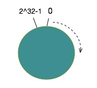
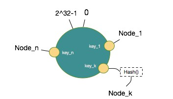
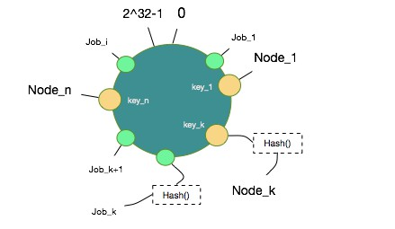
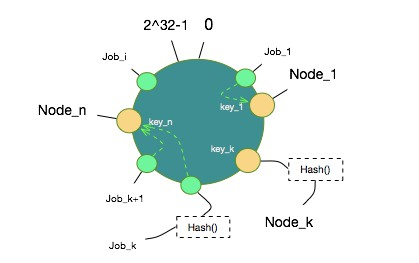
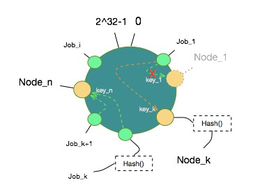
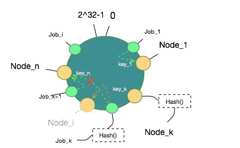
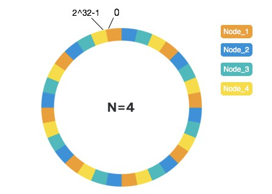

2019-02-27

## 一致性哈希
1. https://my.oschina.net/yaohonv/blog/1610096

### 介绍
1. 分布式系统中经常会被用到
2. 用于尽可能地降低节点变动带来的数据迁移开销
3. 解决节点变动带来的大量数据迁移和数据不均匀分配问题

### 一般hash(取模) -- m个job 在 n个节点
1. 场景
    - n个节点中有一个宕机了, 节点数量=n-1, 映射公式为 hash(job)%(n-1)
    - 由于job数量增加, 需要增加机器, hash(job)%(n+1)
2. 问题
    - 基本上所有的job都会重新分配到一个不同的节点
    - 几乎要迁移所有正在运行的job
    - 给系统带来很大的复杂性和性能消耗

### 一致性hash原理
1. 确定hash值空间
    - 值空间 2^32, [0, 2^32] 所有hash值的取值空间, 一个环
    - 
    
    
2. 节点向值空间映射
    - 去node的hash值, 可以固定标识一个 node的值进行hash
    - 算法中，将以有序Map的形式在内存中缓存每个节点的Hash值对应的物理节点信息
    - 
    

3. 数据(job) 向值空间映射
    -
    
    
4. 数据和节点映射
    - 设定一个规则把哪些数据hash值放在哪些节点Node Hash值上了
    - 沿着顺时针方向，数据hash值向后找到第一个Node Hash值即认为该数据hash值对应的数据映射到该Node上。
    - 
    

### 算法表现
1. 节点减少时，看需要迁移的节点情况
    - 
    
    
2. 节点新增时
    - 
    
    
### 优化
1. 问题
    - 第一，数据对象会不会分布不均匀，特别是新增节点或者减少节点时
    - 第二，如果想让部分节点多映射到一些数据对象，如何处理
2. 解决
    - 将一个物理节点虚拟出一定数量的虚拟节点，分散到这个值空间上，需要尽可能地随机分散开
    - 假设有4个物理节点Node，环上的每个色块代表一个虚拟节点涵盖的hash值区域，每种颜色代表一个物理节点。
    - 当物理节点较少时，虚拟节点数需要更高来确保更好的一致性表现
    -
    

    