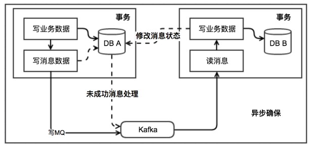
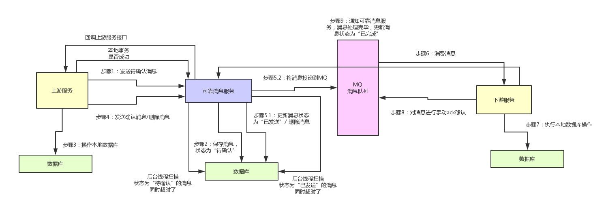

2019-01-08

## 可靠消息最终一致性方案(消息队列)

## 综述
1. 消息生产方，需要额外建一个消息表，**并记录消息发送状态**
2. **消息表和业务数据要在一个事务里提交**，也就是说他们要在一个数据库里面
3. 然后消息会经过MQ发送到消息的消费方。**如果消息发送失败，会进行重试发送**
4. 消息消费方，需要处理这个消息，并完成自己的业务逻辑
5. 此时如果本地事务处理成功，表明已经处理成功了，如果处理失败，那么就会重试执行
6. 如果是业务上面的失败，可以给生产方发送一个业务补偿消息，通知生产方进行回滚等操作。
7. 生产方和消费方定时扫描本地消息表，把还没处理完成的消息或者失败的消息再发送一遍。如果有靠谱的自动对账补账逻辑，这种方案还是非常实用的
8. 优缺点:
    - 优点： 一种非常经典的实现，避免了分布式事务，实现了最终一致性。在 .NET中 有现成的解决方案。
    - 缺点： 消息表会耦合到业务系统中，如果没有封装好的解决方案，会有很多杂活需要处理
    
    
### 核心流程
1. 上游服务投递消息
    - 自己写一个可靠消息服务
    - 上游服务需要发送一条消息给可靠消息服务
        - 标识对下游服务的一个接口调用, 包含对应的请求参数
    - 可靠消息服务将这条消息存储在自己的数据库中, **状态为 "待确认"**
    - 上游服务执行自己的本都数据库操作
        - 根据执行结果,再次调用可靠消息服务的接口
            - 数据库操作成功
                - 找 可靠消息服务确认那条消息
                - **可靠消息服务就把数据库里的消息状态更新为“已发送”**，同时将消息发送给MQ。
                - 很关键的点
                    - **更新数据库里的消息状态和投递消息到MQ。这俩操作，你得放在一个方法里，而且得开启本地事务。**
            - 数据库操作失败
                - 找 可靠消息服务删除消息
2. 下游服务接受消息
    - 消费消息, 操作本地数据库
    - **操作成功了，就反过来通知可靠消息服务，说自己处理成功了，然后可靠消息服务就会把消息的状态设置为“已完成”**           
3. 问题
    - 如何上游服务对消息的100%可靠投递？
        - 没通知成功，或者没执行成功，或者是可靠消息服务没成功的投递消息到MQ。这一系列步骤出了问题怎么办？
            - 此时, 可靠消息服务的数据库中的消息状态一直是 "待确认"
            - 开发一个后台定时运行的线程, 不停的检查各个消息的状态
                - 如果是 "待确认"
                    - 回调上游服务提供的一个接口, 查询本消息对应的数据库操作是否完成
                        - 成功--修改消息状态为 "已发送", 并投递消息MQ
                        - 失败--删除数据库中消息
            - **通过这套机制，就可以保证，可靠消息服务一定会尝试完成消息到MQ的投递**
    - 如何保证下游服务对消息的100%可靠接收?
        - 下游服务消费消息出了问题，没消费到？或者是下游服务对消息的处理失败了，怎么办？
            - 在可靠消息服务里开发一个后台线程，不断的检查消息状态。
            - 如果消息状态为 "已发送" 而不是已完成, 
            - 可靠消息服务可以再次尝试重新投递消息到MQ, 让下游服务再次处理
            - **下游服务需要实现幂等性, 保证多次处理一个消息不会重复插入数据**

### 严重依赖MQ的高可用性
1. 如果MQ宕机怎么办
2. 基于KV存储的队列支持的高可用降级方案
    - MQ挂掉之后, 希望继续投递消息, 必须找一个MQ的替代品
    - redis的队列功能
        - 避免写入数据量过大，否则会导致大value的情况发生，引发严重的后果。
        - 不能往少数key对应的数据结构中持续写入数据，那样会导致热key的产生，也就是某几个key特别热。
            - 一般kv集群，都是根据key来hash分配到各个机器上的，你要是老写少数几个key，会导致kv集群中的某台机器访问过高，负载过大。
    - 下游服务消费MQ的降级感知
        - 判断自己是否还能继续从MQ消费到数据
        - ZK的故障标志位
        - MQ自行封装的组件
    - 故障的自动恢复
        - **降级开关打开之后，自行封装的组件需要开启一个线程，每隔一段时间尝试给MQ投递一个消息看看是否恢复了**
        - zk关闭降级开关，然后可靠消息服务继续投递消息到MQ，
        - 下游服务在确认kv存储的各个队列中已经没有数据之后，就可以重新切换为从MQ消费消息。
 
