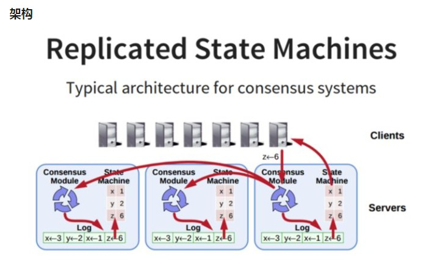
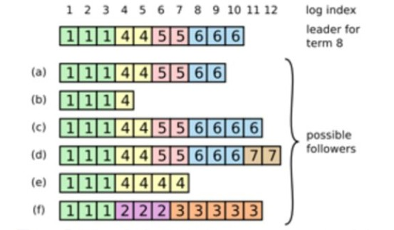
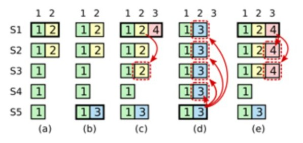

208-07-02

## Raft
1. https://zhuanlan.zhihu.com/p/27207160
2. 动画: http://thesecretlivesofdata.com/raft/

### 意义
1. 一致性协议
1. 在保证即使小部分副本宕机的情况下, 系统仍然能够对外提供服务

### 架构

1. 状态机
    - 一致性就是保证这个状态机的一致性
    - 状态机从log里面取出所有命令, 执行一遍, 得到的结果就是我们对外提供的保持了一致性的数据
2. log
    - 保存了都有修改的记录
3. 一致性模块
    - 用来保证写入的log的命令的一致性, 核心内容
    
### 协议内容
1. 副本状态
    - Leader
        - 所有请求的处理者
        - 接受client的更新请求, 同步其他副本
    - Follower
        - 请求的被动更新者
        - 从leader接受请求, 写入本地日志文件
    - Candidate
        - 如果 Follower 副本在一段时间内没有收到Leader副本的心跳, 则判断Leader可能已经故障
        - 启动选主过程, 此副本会变成 Candidate, 直到选主结束
1. Term概念
    - 时间被分为很多连续的随机长度的term, 
    - term有唯一id
1. Leader Election
    - Follwer 将自己维护的 current_term_id + 1
    - 将自己的状态转换为 Candidation
    - 发送 RequestVoteRPC 消息(带上 current_term_id) 给其他 Server
    - 结果
        - 成为 Leader
            - 收到 majority 的投票, 状态切换为 Leader
            - 定期的给其他Server发送心跳, 告诉对方是 current_term_id 所标识的 term的Leader
            - 每个Term对多只有一个Leader 
            - term作为 logical clock, 在每个RPC消息中都会带上, 用于检测过期消息
                - 如果 server 收到的 rpc_term_id > 本地 current_term_id, 则 current_term_id = rpc_term_id
                - 如果 server.state = Leader/Candidate, 则 server.state = Follower
                - 如果 server.current_term_id > rpc_term_id, 拒绝消息
        - 别人成为 Leader
            - server.state = Follower
            - server.current_term_id = rpc_term_id;
        - 没有选出 Leader
            - 投票被瓜分, 没有 Candidate 收到 majority的投票, 没有Leader选出
            - 每个 Candidate 等待时间过期, 本地 current_term_id +1, 发起新一轮的投票
2. 投票策略
    - **每个节点在每个 Term 只有一次投票机会**
    - 每个Candidate的election timeout从150ms-300ms之间随机取

### Log Replication
1. 每一个请求包含一条需要被 replication state machines 执行的命令
1. Leader把他作为一个 log entry append到日志中, 然后给其他Server发送AppendEntriesRPC请求
1. Leader确定 一个 log Entry 被 safely replicated(大多数副本已将命令写入日志中)
1. **apply 这条log entry 到状态机, commited, 返回客户端**
2. Follower没有及时回复, 一直发

### Log sync

1. 新的Leader 被选出来之后, 它的日志和其他的Follower可能不一致, 需要机制保证日志的一致性
2. Leader会为每个Follower维护一个 nextIndex, 表示leader 发送给各个Follower发送下一条log entry 的 index,
    **初始化为Leader 的最后一条log entry 的下一个位置**
3. 同步
    - Leader --> Follower
        - (term, (nextIndex - 1))
        - 存在, 接受
        - 不存在
            - 拒绝
            - (term, (nextIndex - 1 - 1))
            - 循环
4. 哪些Follower有资格成为Leader
    - **Raft保证被选为新leader的节点拥有所有已提交的log entry**
    - 这个保证是在RequestVoteRPC阶段做的
        - candidate在发送RequestVoteRPC时，会带上自己的最后一条日志记录的term_id和index，
        - 其他节点收到消息时，如果发现自己的日志比RPC请求中携带的更新，拒绝投票。
        - 日志比较的原则是，如果本地的最后一条log entry的term id更大，则更新，如果term id一样大，则日志更多的更大(index更大)
5. 哪些日志被认为是 Commited
    - **leader正在replicate当前term的日志记录给其它Follower，一旦leader确认了这条log entry被majority写盘了，
        这条log entry就被认为是committed**
    - leader正在replicate更早的term的log entry给其它follower
                
                
### 调整

1. 在阶段a，term为2，S1是Leader，且S1写入日志（term, index）为(2, 2)，并且日志被同步写入了S2；
2. 在阶段b，S1离线，触发一次新的选主，此时S5被选为新的Leader，此时系统term为3，且写入了日志（term, index）为（3， 2）;
3. S5尚未将日志推送到Followers变离线了，进而触发了一次新的选主，而之前离线的S1经过重新上线后被选中变成Leader，此时系统term为4，
    此时S1会将自己的日志同步到Followers，按照上图就是将    日志（2， 2）同步到了S3，而此时由于该日志已经被同步到了多数节点（S1, S2, S3），
    因此，此时日志（2，2）可以被commit了（即更新到状态机）；
4. 在阶段d，S1又很不幸地下线了，系统触发一次选主，而S5有可能被选为新的Leader
    （这是因为S5可以满足作为主的一切条件：1. term = 3 > 2, 2. 最新的日志index为2，比大多数节点（如       S2/S3/S4的日志都新），
    然后S5会将自己的日志更新到Followers，**于是S2、S3中已经被提交的日志（2，2）被截断了，这是致命性的错误，
    因为一致性协议中不允许出现已经应用到状态机中的日志被截断**。

### 结果
1. **只允许主节点提交包含当前term的日志**
    - 过程 TODO

### Log Compaction
1. snapshot
    - 原因: 防止日志无线增长, 导致系统重启是需要花费很长的时间进行回放
    - 解决: 丢弃 snapshot 之前的日志
    - 应用: Chubby Zookeeper
2. raft 应用
    - 每个副本独立对自己的系统状态进行 Snapshot
    - 只能对已经提交的日志(已经应用到状态机) 进行 snapshot
3. 缺点
    - 不是增量的
4. 注意
    - 不要做的太频繁
        - 消耗磁盘带宽
    - 不要做得不太频繁
        - 一点节点重启需要回放大量日志
        - **当日志达到一个固定大小之后做一次 Snapshot**
    - 做一次 Snapshot 可能耗时太长
        - copy-on-write
### 集群拓扑变化
1. 运行过程中副本集的结构性变化
    - 增加/减少副本数
    - 节点更换
2. 流程
    - 配置变化, 
        - Leader 人工命令配置变换, 
        - Cold--> Cnew
    - Leader 在本地生成一个 新的 Log Entry, 
        - 内容为 Cold U Cnew, 
        - 代表当前新旧拓扑共存
        - 写入本地日志
        - 推送到其他 Follower
    - Follower 收到 新的 Log Entry
        - 更新本地日志
        - 更新自己的全局拓扑结构
    - 多数 Follower 确认这个日志
        - Leader Commit log Entry
    - Leader 生成新的 Log Entry 
        - 内容: 全新的配置 Cnew
        - 写入本地日志
        - 推送 Follower
    - Follower 收到新的 Cnew
        - 写入本地日志
        - 新的日志为 系统拓扑
        - 发现自己不在Cnew中, 自动退出
    - 多数 Follwer 确认消息
        - Leader 提交
2. 异常分析
    - 如果Leader的Cold U Cnew尚未推送到Follower，Leader就挂了，此时选出的新的Leader并不包含这条日志，此时新的Leader依然使用Cold作为全局拓扑    配置
    - 如果Leader的Cold U Cnew推送到大部分的Follower后就挂了，此时选出的新的Leader可能是Cold也可能是Cnew中的某个Follower；
    - 如果Leader在推送Cnew配置的过程中挂了，那么和2一样，新选出来的Leader可能是Cold也可能是Cnew中的某一个，那么此时客户端继续执行一次改变配       置的命令即可
    - 如果大多数的Follower确认了Cnew这个消息后，那么接下来即使Leader挂了，新选出来的Leader也肯定是位于Cnew这个配置中的，因为有Raft的协议保证。
3. 为什么需要弄这样一个两阶段协议，而不能直接从Cold切换至Cnew？
    - 多个 Follower 系统视图不一致
    - 可能会产生多个 Leader