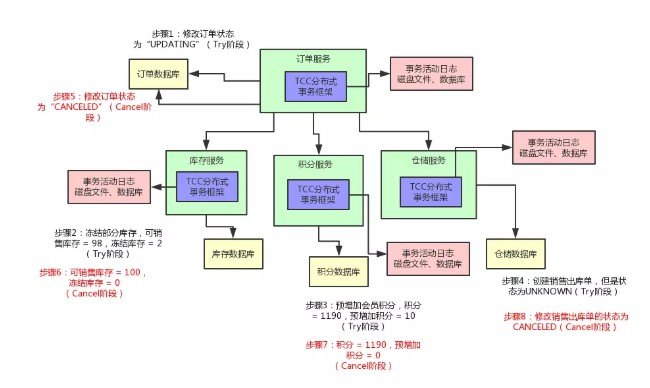

## 分布式事务

### 场景
1. 有一个电商系统，里面有一个支付订单的场景
    - 步骤
        - 更改订单的状态为“已支付”
        - 扣减商品库存
        - 给会员增加积分
        - 创建销售出库单通知仓库发货
    - 
        
        

2. 最终一致性分布式事务如何保障实际生产中99.99%高可用
    - 基于MQ的异步调用，如何保证各个服务间的分布式事务呢
    
