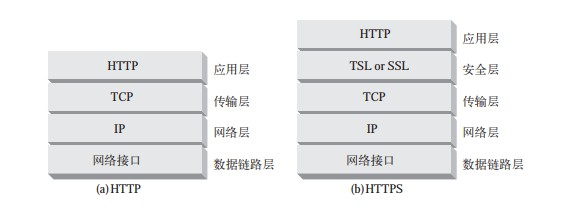
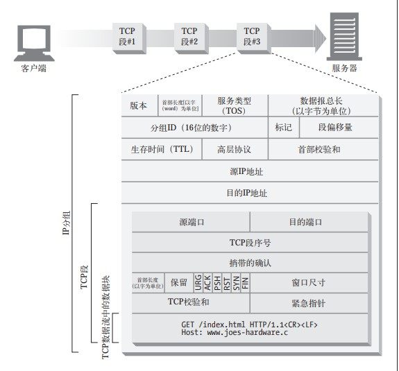
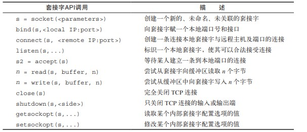
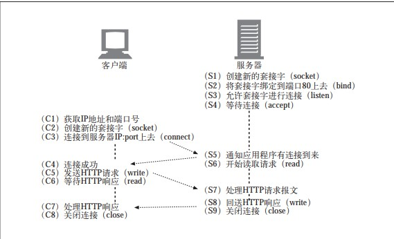

209-04-09

## Http:web的基础

### HTTP概述
1. 媒体类型
    - MIME type(Multipurpose Internet Mail Extension, 多用途因特网邮件扩展)
    - 描述以及标记多媒体内容
    - 告诉客户端如何处理这个对象
    - 类型是一种文本标记，表示一种主要的对象类型和一个特定的子类型，中间
      由一条斜杠来分隔
2. URI URL URN
    - URI
        - 统一资源标识符(Uniform Resource Identifier)
        - 唯一标识并定位信息资源
        - 有两种形式: URL, URN
    - URL
        - 统一资源定位符（URL）是资源标识符最常见的形式
        - 描述一台特定服务器上某资源的特定位置
        - 标准
            - 协议类型: http://
            - 服务器的因特网地址: www.baidu.com
            - 其余部分指定web服务器上的某个资源: /spea/11.gif
        - 几乎所有的URI都是 URL
    - URN
        - 统一资源名
        - URN 是作为特定内容的唯一名称使用的，与目前的资源所在地无关。
        - 使用这些与位置无关的 URN，就可以将资源四处搬移
3. 报文
    - 三个部分
        - 起始行
            - 第一行
            - 在请求报文中说明要做什么., 在响应报文中说明 出现了什么情况
        - 首部字段
            - 起始行下一行
            - K:V
        - 主体
            - 可选
            - 请求主题包含了发送给服务器的数据, 响应主体包含返回给客户端的数据
            - 任意的二进制数据 

### 连接
1. 基于 TCP/IP

### Web 结构组件
1. 代理
    - 位于客户端和服务器之间的 HTTP 中间实体
    - 安全, 应用集成, 性能优化???
    - 过滤请求与响应
2. 缓存
    - HTTP的仓库, 常用页面副本可以保存在离客户端更近的地方
    - 常用文档缓存在代理中, 
3. 网关
    - 连接其他应用程序的特殊 Web 服务器。
    - **通常用于将 HTTP 流量转换成其他的协议**
4. 隧道
   - 对 HTTP 通信报文进行盲转发的特殊代理。
   - 建立起来之后，就会在两条连接之间对原始数据进行盲转发的HTTP 应用程序。
   - HTTP 隧道通常用来在一条或多条 HTTP 连接上转发非 HTTP 数据，转发时不会窥探数据。
5. Agent 代理
    - 发起自动 HTTP 请求的半智能 Web 客户端。
    
    
### URL 与资源
1. 片段
    - TODO

### HTTP 报文
1. 报文流
2. 报文的组成部分
    - 报文的语法
        - 请求报文
            - method request-url version
            - headers
            -      
            - entity-boby            
        - 响应报文
            - version status reason-phrase
            - headers
            -
            - entity-boby
3. 状态码
    - 100-199 信息提示
        - 100 Continue
            - 客户端应用程序只有在避免向服务器发送一个服务器无法处理或使用的大实体时，才应该使用 100 Continue。
            - 询问服务器是否可以接收大实体
    - 200-299 成功
       - 200 OK
    - 300-399 重定向
        - 301 Moved Permanently 
            - 在请求的 URL 已被移除时使用。响应的 Location 首部中应该包含资源现在所处的 URL
    - 400-499 客户端错误
        - 400 Bad Request
        - 401 Unauthorized
        - 403 Forbidden
        - 404 Not Found
    - 500-599 服务器错误
        - 500 Internal Server Error 
            - 服务器遇到一个妨碍它为请求提供服务的错误时，使用此状态码
        - 501 Not Implemented 
            - 客户端发起的请求超出服务器的能力范围（比如，使用了服务器不支持的请求方法）时，使用此状态码
4. 首部
    - 通用首部
        - **既可以出现在请求报文中，也可以出现在响应报文中。**
        - Date
        - Content-length
        - Content-type
        - Accept
            - Accept 告诉服务器能够发送哪些媒体类型
            - Accept-Charset 告诉服务器能够发送哪些字符集
            - Accept-Encoding 告诉服务器能够发送哪些编码方式
            - Accept-Language 告诉服务器能够发送哪些语言
        - 缓存首部
            - Cache-Control 用于随报文传送缓存指示
    - 请求首部
        - 提供更多有关请求的信息。
        - Client-IP
        - Host
        - Authorization 包含了客户端提供给服务器，以便对其自身进行认证的数据
        - Cookie 客户端用它向服务器传送一个令牌——它并不是真正的安全首部，但确实
          隐含了安全功能 
    - 响应首部
        - 提供更多有关响应的信息。
        - Age （从最初创建开始）响应持续时间
        - Server 服务器应用程序软件的名称和版本
        - Set-Cookie 不是真正的安全首部，但隐含有安全功能；可以在客户端设置一个令牌，
          以便服务器对客户端进行标识 
    - 实体首部
        - **描述主体的长度和内容，或者资源自身。**
        - 告知报文的接收者它在对什么进行处理。
        - Location 告知客户端实体实际上位于何处；用于将接收端定向到资源的（可能是新的）位置（URL）上去
        - Content-Encoding 对主体执行的任意编码方式
        - Content-Language 理解主体时最适宜使用的自然语言
        - Content-Length 主体的长度或尺寸
        - Content-Location 资源实际所处的位置
        
        
### 连接管理
1. TCP 连接
    - TCP 流式分段的, 由IP 分组传送的
        - 
        
    - 保持TCP连接持续不断地运行
        - 
        
    - 用TCP套接字编程
         -
         
         -
         

2. 对TCP性能的考虑
    - HTTP事务的时延
        - DNS解析
        - 建立TCP连接
        - 发送HTTP报文, 读取报文
        - 返回响应报文
    - 性能聚焦区域
        - TCP连接建立
        - TCP慢启动拥塞算法
            - TCP 数据传输的性能还取决于 TC自我“调谐”，起初会限制连接的最大速度，如果数据成功传输，会随着时间的推移
              提高传输的速度。
            - 这种调谐被称为 TCP 慢启动（slow start），用于防止因特网的突然过载和拥塞
        - 数据聚集的 Nagle 算法(TCP_NODELAY)
        - 用于捎带确认的TCP 延迟确认算法
        - TIME_WAIT 时延和端口耗尽
            - 2MSL

3. HTTP 连接的处理
    - Connection 首部
        - HTTP/1.1 已默认是持久连接
    - 串行事务处理时延
        - 并行连接
            - 多条TCP 并发HTTP
            - 每个事务都会打开 / 关闭一条新的连接，会耗费时间和带宽。
            - 由于 TCP 慢启动特性的存在，每条新连接的性能都会有所降低。
            - 可打开的并行连接数量实际上是有限的。
        - 持久连接
            - 重用TCP, 消除连接和关闭时延
        - 管道化连接
            - 通过共享的 TCP 连接发起并发的 HTTP 请求。(队列)
    - 持久连接的限制和规则
        - 发送了 Connection: close 请求首部之后，客户端就无法在那条连接上发送更
          多的请求了。
        - 如果客户端不想在连接上发送其他请求了，就应该在最后一条请求中发送一个
          Connection: close 请求首部。
        - 只有当连接上所有的报文都有正确的、自定义报文长度时——也就是说，实体主
          体部分的长度都和相应的 Content-Length 一致，或者是用分块传输编码方式
          编码的——连接才能持久保持。
        - HTTP/1.1 的代理必须能够分别管理与客户端和服务器的持久连接——每个持久
          连接都只适用于一跳传输。
        - 尽管服务器不应该试图在传输报文的过程中关闭连接，而且在关闭连接之前至少
          应该响应一条请求，但不管 Connection 首部取了什么值，HTTP/1.1 设备都可
          以在任意时刻关闭连接。
    - 管道化连接
        - 在响应到达之前，可以将多条请求放入队列。当第一条请求通过网络
          流向地球另一端的服务器时，第二条和第三条请求也可以开始发送了
        - 限制
            - 必须是持久的
            - 按照请求的顺序返回响应
            - 客户端要有 重发的准备
            - 不适用非幂等请求
        