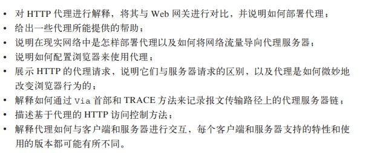

2019-04-11

## HTTP 结构

### web服务器
1. web服务器的实现
    - 逻辑实现 HTTP
    - 管理web资源
    - 负责提供问web服务器的管理功能
    - 和操作系统共同负责管理 TCP 连接
2. 做什么
    - 接收客户端连接
    - 接收请求报文
    - 处理请求
    - 最资源的映射与访问 
        - 目录列表
        - 动态内容资源映射
        - 访问控制
    - 构建响应
    - 发送响应
    - 记录日志

### 代理

1. web的中间实体
    - Web 上的代理服务器是代表客户端完成事务处理的中间人
    - HTTP 的代理服务器既是 Web 服务器又是 Web 客户端 
2. 为什么使用代理
    - 儿童过滤器
    - 文档访问控制
        - 集中式访问控制
    - 安全防火墙
    - web缓存
    - 反向代理
    - 内容路由器
    - 转码器
3. 代理去往何处
    - 代理服务器的部署
        - 出口代理
        - 访问(出口)代理
    - 动态选择父代理
        - 均衡负载
            - 根据当前父代理的工作负载来决定如何选择一个父代理
        - 地理位置附近的路由
        - 协议 / 类型路由
            - 子代理可能会根据 URI 将报文转发到不同的父代理和原始服务器上去
    - 代理是如何获取流量的
        - 修改客户端
        - 修改网络
        - 修改 DNS 的命名空间
        - 修改 Web 服务器 
4. 追踪报文
    - via
    - trace
    - TODO
    
### 缓存
1. 冗余的数据传输
2. 带宽瓶颈
3. 瞬间拥塞
    - 类似 秒杀
4. 距离时延
5. 命中和未命中
    - 再验证(新鲜度检测)
    - 命中率
        - 请求次数命中率(缓存命中率)
        - 字节命中率
            - 缓存提供的字节在传输的所有字节中所占的比例
6. 缓存的拓扑结构
    - 代理缓存的层次结构
        - 多级缓存
    - 网状缓存, 内容路由, 对等缓存
        - 根据 URL 在父缓存或原始服务器之间进行动态选择。
        - 根据 URL 动态地选择一个特定的父缓存。
        - 前往父缓存之前，在本地缓存中搜索已缓存的副本。
        - 允许其他缓存对其缓存的部分内容进行访问，但不允许因特网流量通过它们的缓存。
1. 缓存的处理步骤
    - 接收
    - 解析
    - 查询: 缓存
    - 新鲜度检测
    - 创建响应
    - 日志
    - 发送
        
1. 保持副本的新鲜
    - Cache-Control: max-age
        - HTTP/1.1
        - 相对时间, **距离当前的秒数**
    - Expires
        - HTTP/1.0
        - 绝对时间
    - 用条件方法进行再验证
        - If-Modified-Since
            - 如果从指定日期之后文档被修改过了，就执行请求的方法
        - If-None-Match
            - 服务器可以为文档提供特殊的标签
            - 标签不一致, 刷新
            - 适用
                - 文档被周期重写, 内容没有变化, 最后自改时间变化了
                - 修改太快速
                - 无法确定修改时间
1. 控制缓存的能力
    - 附加一个 Cache-Control: no-store 首部到响应中去；
    - 附加一个 Cache-Control: no-cache 首部到响应中去；
    - 附加一个 Cache-Control: must-revalidate 首部到响应中去；
    - 附加一个 Cache-Control: max-age 首部到响应中去；
    - 附加一个 Expires 日期首部到响应中去；
    - 不附加过期信息，让缓存确定自己的过期日期。

1. 试探性过期
    - TODO 
1. 新鲜期计算算法
    - TODO