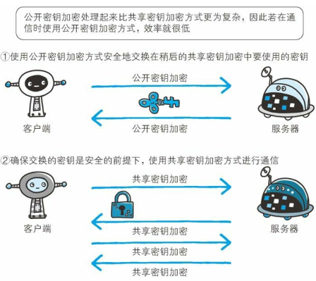

2017-12-06

## HTTPS

### 不足举例
1. 使用明文, 可能被窃听
    - 通信加密
        - SSL (Secure Socket Layer, 安全套接层)
        - TLS (Transport Layer Security, 安全层传输协议)
    - 内容加密
2. 不验证通信方的身份
    - DOS攻击(Denial of Service, 拒绝服务攻击)
    - 证书
4. 无法证明报文的完整性
    - 中间人攻击(Man-in-the-Middler attack, MITA)

### HTTP安全要求
1. 服务器认证
    - 客户端要知道它正在和真正的而不是伪造的服务端通话
2. 客户端认证
    - 服务端要知道它正在和真正的而不是伪造的客户端通话
3. 完整性
    - 客户端和服务端的数据不会被修改
4. 加密
    - 对话是私密的,不会被窃听
5. 效率
    - 足够快的算法, 降低客户端和服务器的使用 
6. 普适性

### 数字加密
1. 密码
    - 一套编码方案
    - 明文
    - 密文
2. 密钥
    - 密码的参数
3. 对称密钥加密
    - 加解密使用的密钥相同
    - 缺点
        - 双方对话之前, 要有一个共享的保密密钥
        - 如果是多个节点N, 会有 N^2 个保密密钥
4. 公开密钥加密
    - 两个非对称密钥
        - 公钥 私钥
        - 编码 解码
5. 混合加密和会话密钥
    - 公开密钥加密算法的计算可能很慢
    - 常见做法
        - 通过公开密钥加密技术建立安全通信, 
        - 再用安全通道发送临时的随机对称密钥
        - 通过更快的对称加密对其余的数据进行加密
6. 数字签名
    - 对报文进行 签名
    - 说明谁编写的报文, 同时证明报文没有被篡改过
    - 附加在报文上的特殊加密校验码
6. 数字证书
    - 包括对象的 公开密钥, 以及对象和所用签名算法的描述性信息

### HTTPS 握手
1. client 给出协议版本号, 一个客户端的 **随机数(client random)**, 以及客户端支持的加密算法
2. server 确认双方的加密方法, 给出数字证书 以及 **server random**
3. client 确认数字证书有效, 生成一个新的随机数 **Premaster secret**, 使用数字证书的公钥 加密随机数 --> server
4. server 使用 私钥 机密 Premaster secret
5. client 和 server 根据约定的加密算法, **使用前面三个随机数, 生成对话密钥**, 对称加密, 随后的通话

### 握手的问题
1. 第一 和 第二 个随机数 以及加密算法 都可以获取, 只有 第三个随机数无法获取(因为要验证证书有效)
2. 通话的安全, 取决于第三个随机 Premaster secret 能不能 被破解
    - TODO


### HTTPS
1. HTTPS = HTTP + 加密 + 认证 + 完整性保护
2. 身披 SSL 外壳的 HTTP

### SSL
1. 公开密钥加密


### 共享密钥
- 加密和解密同用一个密钥的方式称为共享密钥加密,也叫对称密钥加密
- 缺点：如果通信中,密钥落入攻击者手中,失去了加密的意义

### 公开密钥加密
- 使用一对非对称的密钥,一个叫私有密钥,一个叫公开密钥,发送密文的一方使用对方的公开密钥进行加密,
对方收到被加密的信息后,使用自己的私有密钥进行解密
- 缺点：但是公开密钥加密与共享密钥加密相比， 其处理速度要慢。

### SSL:相互交换密钥的公开密钥加密技术（混合加密机制）
- 在交换密钥环节使用公开密钥加密方式,之后建立的通信交换报文阶段使用共享加密方式
- 缺点：无法证明公开密钥本身是由预想的服务器发行的公开密钥
- 解决方式：可以使用由数字证书认证机构（CA， CertificateAuthority） 和其相关机关颁发的公开密钥证书
- 认证机关的公开密钥如何安全的转交给客户端：多数浏览器开发商发布版本时， 
会事先在内部植入常用认证机关的公开密钥


### HTTPS认证过程
1. 服务器的公开密钥 去 数字认证机构
2. 数字认证机构同 自己的私有密钥, 对 公开密钥 署数字签名, 并颁发数字证书
3. 数字证书 浏览器 已 事先植入
4. 客户端拿到服务器的公钥证书, 使用数字证书机构得得公开密钥, 向数字证书机构验证公钥证书上的数字签名., 确认服务器的公开密钥的真实性
5. 客户端使用服务器的公开密钥对信息进行加密
6. 服务器用私有密钥 解密









