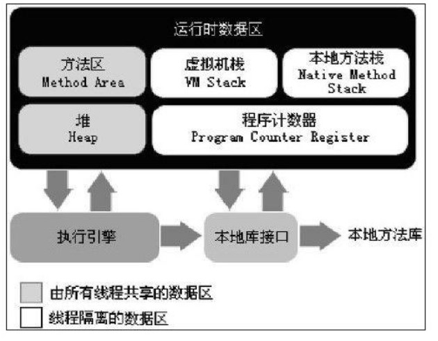

2018-09-0-19

## 自动内存管理机制

### 运行时数据区域

1. 程序计数器
    - 线程私有
    - 当前线程所执行的字节码的行号指示器
    - **为了线程切换后能恢复到正确的执行位置**
2. java虚拟机栈
    - 线程私有
    - java Virtual Machine Stacks
    - 描述java方法执行的内存模型
    - 两种异常状况
        - 线程所请求的栈深度大于虚拟机所允许的的深度 -- StackOverFlowError
        - 虚拟机可以动态扩展, 如果扩展时无法申请到足够的内存 -- OutOfMemoryError
3. 本地方法栈
    - 线程私有
    - 和虚拟机栈的作用类似
    - 为拟机使用到的Native方法提供服务
    - 依然会有相同的异常
4. java 堆
    - 线程共享
    - 垃圾收集器管理的主要区域
    - GC堆
    - 分代收集算法
        - 新生代
            - Eden空间
            - From Survivor 空间
            - To Survivor 空间
        - 老年代
    - 进一步划分的目的就是为了更好的回收内存, 更快的分配内存
5. 方法区
    - 线程共享 
6. 运行时常量池
    - String.intern()
7. 直接内存
    - 不是虚拟机运行时数据区的一部分
    - 也不是java虚拟机规范中定义的内存区域
    - 因为NIO引入了一个基于通道(channel) 和 缓冲区(buffer) 的IO方式, 使用Native函数库直接分配堆外内存,
    - 通过存储在java堆中的 DirectByteBuffer 对象作为这块内存的引用进行操作
    - **避免了在java堆和Native堆中来回复制数据来提高性能**
    - Netty -- 零拷贝
    
### HotSpot虚拟机对象探秘
1. 对象的创建
    - 定位一个符号引用
    - 代表的类 是否被加载 解析 初始化
    - **对象所需内存的大小在类加载完成之后可以完全确定**
    - 指针碰撞 (Bump the Pointer)
        - 假设内存绝对规整
            - **由所采用的的gc是否带有压缩整理的功能决定: Serial, ParNew**
        - 用过的内存放在一边, 没有用过的放在另外一边, 中间一个指针作为分界点的指示器, 
        - 所需内存仅仅是把分界指针向空闲空间那边挪动一段与对象大小相等的具体
    - 空闲列表 (Free List)
        - 不规整, 相互交错
            - CMS基于Mark-Sweep(标记清除)算法gc
        - 虚拟机必须维护一个列表, 记录哪些内存块可用, 在分配的时候从列表中选择一个足够大的空间划分给对象实例
        - 跟新列表上的记录
    - 并发情况下的线程安全
        - CAS + 失败重试
        - 按照线程划分不同的空间之中进行
            - 本地线程分配缓冲(Thread Local Allocation Buffer, TLAB)
            - 用完需要分配新的, 在同步锁定
    - 对象头
        - TODO
2. 对象的布局
    - 对象头(Header)
        - 对象自身的运行时数据
            - **哈希码, GC分代年龄, 线程持有的锁**, 偏向线程ID, 偏向时间戳
    - 实例数据(Instance Data)
        - 类变量
    - 对其填充(Padding)
3. 对象的访问
    - 句柄访问
        - 有一个句柄池作为中间层
        - 对象移动不会影响reference中存储的句柄地址
    - 直接指针
        - 速度快

### OOM 实战
1. 内存泄漏
    - GC Roots

