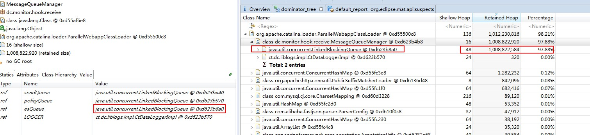

2018-09-29

## java.lang.OutOfMemoryError: Java heap space

### 发现异常
1. Exception in thread "nioEventLoopGroup-2-1" Exception in thread "http-nio-9099-Acceptor-0" Exception in thread "pool-2-thread-1" 
    java.lang.OutOfMemoryError: Java heap space
2. Exception in thread "pool-1-thread-1" java.lang.OutOfMemoryError: Java heap space

### 判断
1. 之前 加载了大量基础数据
1. 堆内存不足

### 查看当前堆信息
1. jmap -heap 17496
````
Attaching to process ID 17496, please wait...
Debugger attached successfully.
Server compiler detected.
JVM version is 25.151-b12

using thread-local object allocation.
Mark Sweep Compact GC

Heap Configuration:
   MinHeapFreeRatio         = 40
   MaxHeapFreeRatio         = 70
   MaxHeapSize              = 1073741824 (1024.0MB)
   NewSize                  = 357892096 (341.3125MB)
   MaxNewSize               = 357892096 (341.3125MB)
   OldSize                  = 715849728 (682.6875MB)
   NewRatio                 = 2
   SurvivorRatio            = 8
   MetaspaceSize            = 21807104 (20.796875MB)
   CompressedClassSpaceSize = 1073741824 (1024.0MB)
   MaxMetaspaceSize         = 17592186044415 MB
   G1HeapRegionSize         = 0 (0.0MB)

Heap Usage:
New Generation (Eden + 1 Survivor Space):
   capacity = 322109440 (307.1875MB)
   used     = 316896424 (302.21598052978516MB)
   free     = 5213016 (4.971519470214844MB)
   98.38160098629832% used
Eden Space:
   capacity = 286326784 (273.0625MB)
   used     = 286326776 (273.06249237060547MB)
   free     = 8 (7.62939453125E-6MB)
   99.99999720598964% used
From Space:
   capacity = 35782656 (34.125MB)
   used     = 30569648 (29.153488159179688MB)
   free     = 5213008 (4.9715118408203125MB)
   85.43146713312728% used
To Space:
   capacity = 35782656 (34.125MB)
   used     = 0 (0.0MB)
   free     = 35782656 (34.125MB)
   0.0% used
tenured generation:
   capacity = 715849728 (682.6875MB)
   used     = 715849696 (682.6874694824219MB)
   free     = 32 (3.0517578125E-5MB)
   99.99999552978807% used

18990 interned Strings occupying 2357480 bytes.
````
2. 年轻代和老年代基本用完
2. 确定判断

### 查看GC信息
1. jstat -gcutil 17496 1000
````
  S0     S1     E      O      M     CCS    YGC     YGCT    FGC    FGCT     GCT   
 85.64   0.00 100.00 100.00  97.41  94.28    159    3.870   812  551.837  555.707
 85.64   0.00 100.00 100.00  97.41  94.28    159    3.870   812  551.837  555.707
 85.64   0.00 100.00 100.00  97.41  94.28    159    3.870   812  551.837  555.707
 85.65   0.00 100.00 100.00  97.41  94.28    159    3.870   812  551.837  555.707
 85.65   0.00 100.00 100.00  97.41  94.28    159    3.870   812  551.837  555.707
 85.70   0.00 100.00 100.00  97.41  94.28    159    3.870   812  551.837  555.707
 85.72   0.00 100.00 100.00  97.41  94.28    159    3.870   812  551.837  555.707
 85.72   0.00 100.00 100.00  97.41  94.28    159    3.870   812  551.837  555.707
 85.72   0.00 100.00 100.00  97.41  94.28    159    3.870   812  551.837  555.707
 85.72   0.00 100.00 100.00  97.41  94.28    159    3.870   812  551.837  555.707
 85.77   0.00 100.00 100.00  97.41  94.28    159    3.870   812  551.837  555.707
 85.78   0.00 100.00 100.00  97.41  94.28    159    3.870   812  551.837  555.707
 85.78   0.00 100.00 100.00  97.41  94.28    159    3.870   812  551.837  555.707
 85.78   0.00 100.00 100.00  97.41  94.28    159    3.870   812  551.837  555.707
````
2. 基本全满
2. 再次确定判断

### 推测
1. 应该是 基础数据增大,
2. 重新加载过于频繁
3. 旧的基础数据没有被回收

### 导出堆栈信息

1. jmap -dump:live,format=b,file=/tmp/dump.bin 17496
2. es待发送queue已满

### 确定问题
1. 发送 esQueue太大 , GC 无法回收

### 分析原因
1. 发送 HTTP 到 Logstach太慢
2. HTTP 阻塞, 导致 esQueue 队列size一直在增加
3. gc 又 无法回收
4. 上升到老年代...

### 解决
1. 修改为 UDP 发送

### 其他
1. Nginx
    - worker_connections  20000
    - worker_connections 设置大一点不要紧
    - 不然 会造成 worker_connections not enough 错误

### 思考
1. TODO - UDP 到底如何丢数据
2. 什么是一个程序的性能瓶颈: 代码 ?? 机器性能?? TODO - 可以分析一下
3. redis--> maxmemory 溢出

