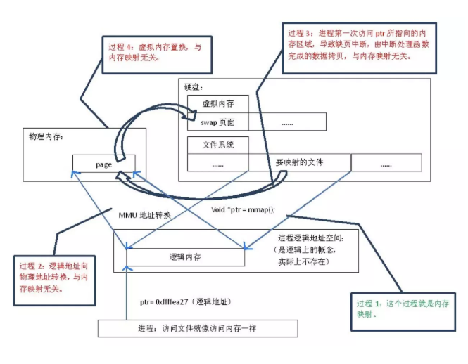

2019-06-26

## mmap
1. 操作系统读写文件流程
1. mmap内存映射
1. mmap的优点

### 内存映射
1. 将文件的磁盘扇区 映射 到进程的虚拟内存空间的过程

### 操作系统读写文件
1. 读文件
    - **文件内容从硬盘拷贝到内核空间的一个缓冲区, 然后再 拷贝到用户空间**
    - 两次数据拷贝
2. 写
    - 用户空间 --> 内核空间 --> 硬盘
3. 如果两个进程同事对一个文件内容访问, 这个文件内容就会在物理空间中存储三份
    - 两次拷贝导致效率过低
    
### 映射
1. 硬盘上文件 的位置与进程逻辑地址空间 中一块大小相同的区域之间的一一对应。
    - 这种对应关系纯属是逻辑上的概念，物理上是不存在的，原因是进程的逻辑地址空间本身就是不存在的
    
### 阶段
1. 启动映射, 并在虚拟地址空间中为映射创建虚拟映射区域
2. **调用内核空间的系统调用函数mmap**
    - 实现文件物理地址和进程虚拟地址一一 映射关系
3. 进程发起对这片映射空间的访问，**引发缺页异常，实现文件内容到物理内存（主存）的拷贝**;

### 结论
1. 常规文件操作需要从磁盘到页缓存再到用户主存的两次数据拷贝。
2. 而mmap操控文件，只需要从磁盘到用户主存的一次数据拷贝过程。
3. **mmap的关键点是实现了用户空间和内核空间的数据直接交互而省去了空间不同数据不通的繁琐过程**。因此mmap效率更高。