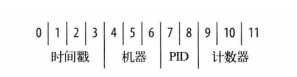

2019-03-21

## 基础知识

### 文档
1. 键不能含有\0(空字符), 这个字符用于表示键的结尾
2. . 和 $ 具有特殊意义
3. 不但区分类型, 而且区分大小写

### 集合
1. 动态的
2. 命名
    - 集合名不能使用空字符串
    - 不能包含\0 空字符
    - 不能以 "system." 开头
    - 子集合
        - 组织集合的一种惯例是使用 . 分隔不同命名空间的子集合
        
### 数据库
1. 不能使用空字符串
2. 基本上 只能使用ASCII 中的字母和数据
3. 区分大小写
    - 做好小写

### 数组
1. {"things" : ["pie", 3.14]}
2. 数组可以包含不同类型的元素

### _Id 和 ObjectId

1. 12字节(24个十六进制)
2. 

