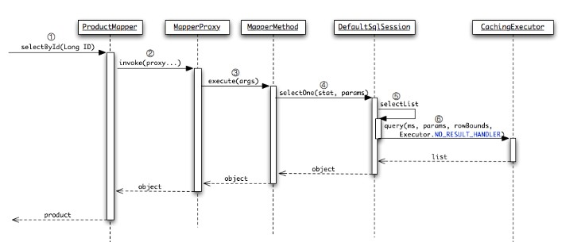

2018-11-07

## 缓存 
1. http://denger.iteye.com/blog/1126423

### 缓存模块
1. 装饰器模式
2. 缓存
    - FifoCache, LruCache
    - SoftCachg, WeakCache
        - hardLinksToAvoidGarbageCollection(LinkedList)
            - 最近使用的一部分缓存不会被 GC 回收, 将其 **Value** 添加到 LinkedList 中
        - 缓存项的 value 是 弱/虚 引用, key 是强引用...
    - ScheduledCache, LoggingCache, SynchronizedCache, SerializedCache
        - ScheduledCache: 周期性清除缓存
        - LoggingCache: Cache 的命中次数和访问次数
        - SynchronizedCache: 为给个方法添加 synchronized, 实现同步功能, 类似 SynchronizedCollection
        - SerializedCache: value 对象序列化
3. 问题与解决
    - 一级缓存默认基于 sqlSession, 当有多个sqlSession对同一块数据进行操作的时候, 就会有一个读到脏数据
        - 启用二级缓存
        - localCacheScope=STATEMENT, 只有在单条语句会被缓存
    - 二级缓存是针对namespace的, 当有其中一个sql是针对多表进行操作的话, 就会影响其他 缓存
        - 使用 cache-ref, 多个 namespace 使用同一块缓存
        
### 缓存之前的调用过程

### CacheingExecutor
1. 二级缓存执行器
2. 灵活地使用 delegate机制
2. 从二级缓存中进行查询 -> [如果缓存中没有，委托给 BaseExecutor] -> 进入一级缓存中查询 -> [如果也没有] -> 则执行 JDBC 查询

### 刷新间隔
1. flushInterval
2. 在 每次使用的时候 再去和上次刷新时间比较, 惰性

### 二级缓存
1. 默认关闭
    - 在 mapper.xml 中添加 cache 节点 或者在 config.xml 的 setting 节点中 cacheEnable = true
2. SqlSession关闭后才会将数据写到二级缓存区域
3. 查询多于修改时使用二级缓存 

### flushCache, useCache
1. 当为select语句时：
    - flushCache默认为false，表示任何时候语句被调用，都不会去清空本地缓存和二级缓存。
    - useCache默认为true，表示会将本条语句的结果进行二级缓存。
2. 当为insert、update、delete语句时
    - flushCache默认为true，表示任何时候语句被调用，都会导致本地缓存和二级缓存被清空。
    - useCache属性在该情况下没有

