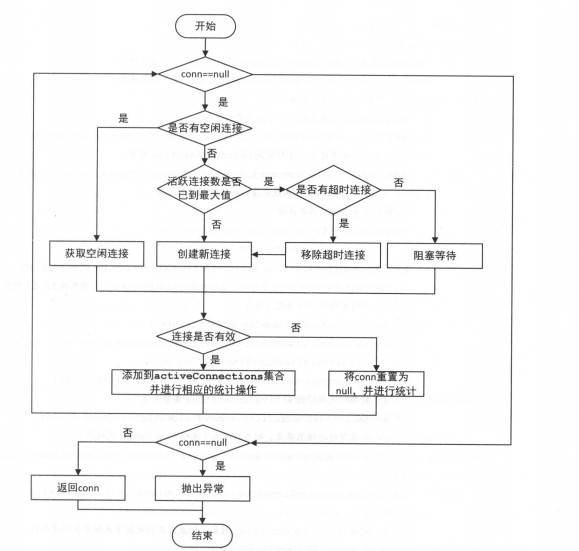
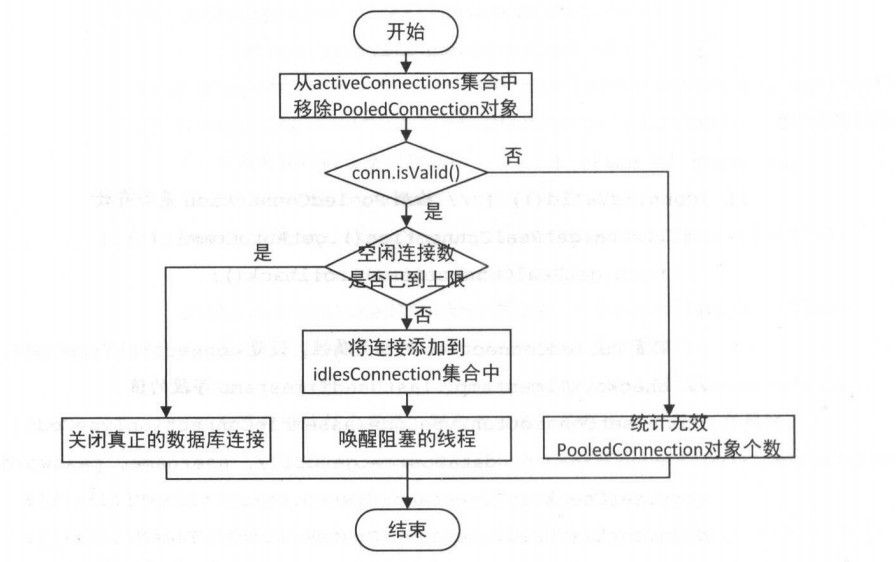

2018-11-07

## 基础支持层

### 反射工具箱
1. 方法的唯一签名
    - 返回值+名字+参数列表
    
### 类型转换
1. TypeHandler
    - BaseTypeHandler
        - IntegerTypeHandler
    - 借助 PreparedStatement, ResultSet 本身的方法
2. TypeHandlerRegistry
    - Map
    - type-Handler
    - jdbcType-Handler
3. TypeAliasRegistry
    - Map
    - 自动扫描

### 日志模块
1. 适配器模式
    - 支持多种日志组件
        - 按照顺序尝试
2. 代理模式和 JDK 动态代理
    - 延时加载
        - 访问数据库, 得到一个代理对象. 此时没有执行查询操作, 在真正需要使用数据时, 再调用代理对象查询数据库并返回数据
    - 解耦
3. 实现
    - 利用动态代理不侵入代码 实现 Log

### 资源加载
1. 好几个 classLoader, 总有一个可以的
    - 好狠
    - ClassLoaderWrapper
        - new ClassLoader[]{
                  classLoader, 
                  defaultClassLoader, 
                  Thread.currentThread().getContextClassLoader(), 
                  getClass().getClassLoader(), 
                  systemClassLoader}; 
                  
### DataSource
1. 获取连接
    - 
    

2. 关闭连接
    - 
     
    
### Binding 模块
1. 解决问题
    - 在数据库操作的过程中, 如果错将具体的方法名(配置文件)写错, 只有在真正执行的时候才会报错
2. 特点
    - 一个接口, 
    - 定义SQL语句对应的方法
    - 不需要实现
2. 作用
    - 提前发现问题