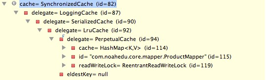

2018-11-12

## 思考
1. Interface 与 xml 的关系
    - 提前发现错误

2. 软 弱 引用的应用
    - SoftCache
    - WeakCache
    
3. 二级缓存的装饰器模式
    - 顺便解决 缓存 并发的问题
        - SynchronizedCache
    - 
    
    
3. 获取插入后的自增主键的实际过程
    - useGeneratedKeys = true
    - keyProperty
    - **那个对象**

4. 理解 批量更新的时候 自增主键的获取过程
    - commit之后

5. ${} #{} 源码中具体的解析方式
    - TODO
    
5. 插件(拦截器)的入口
    - TODO