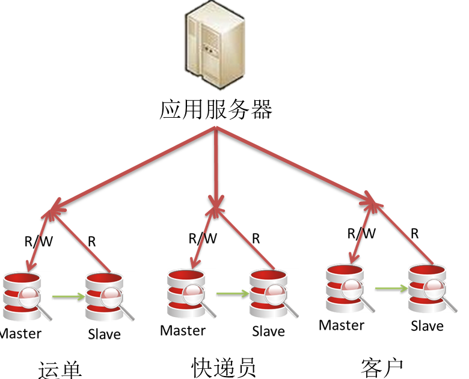

2019-09-05

## 背景

### 关系型数据库的瓶颈
1. 一般 Mysql 数据库超过 1KW, 性能就会明显下降
    - 我们常常建立索引 来优化查询, 因为索引都是在内存中,
    - 当数据量过大的时候, 就会引起索引所需求的内存增加
        - 索引过多, 造成B+Tree 的高度增加, 增加的IO次数
        - 如果内存不足, 就会引起 内存和磁盘的交换, 严重降低查询效率

### 举例 以及 发展进程
1. 客户完成下单, 快递员接受并更新运单状态, 客户随时查询运单状态

2. 放在同一个库里, 随着业务量越来越大, 响应时间变慢, 根据模块做垂直拆分

3. 运单表数量 超过千万, 为了不影响 TPS, QPS, 对运单表做 水平拆分
    - 问题
        - 分片表关联的操作 order by, group by, join, 就不能通过数据库本身来完成
        - 跨分片事务 难以实现
    - 拆分原则
        - 如果我们的整体业务小于单库可承受的 TPS, 并且每周产生的数据量 < 2kw,而且记录要保存一周 --> 按照日期分片 
            - 同一天的压力都会分配到一个分片上, 其他分片空闲 不利于以后扩展
        - 按照 运单号 对 分片个数 取模, 
            - 如果以后分片不够了, 扩展是个问题: 造成老的数据 出现在新的分片上

### 谁来分库分表
1. 数据库层
    - 需要较高的专业程度
    - 一般不选择
2. 应用层
    - 和动态配置中心 结合
    - 应用访问配置中心, 获取配置, 得知应该访问那个数据库, 以及分片规则
    - 然后访问数据库, 并分片以及合并结果
    - 好处
        - 分片和聚合分摊到每个应用
        - 根据业务场景完成相应功能
        - 轻量
        - 最大程度发挥数据库的能力
    - 局限
        - 以来额外配置以及
        - 侵入
        - 应用出问题难以定位
        - 业务开发和分库分表耦合, 难于开发管理
3. 中间件
    - 实现 mysql 协议栈, 将自己伪装成 mysql, 代理mysql实例, 实现分库分表, 结果合并
    - 好处
        - 对应用没有侵入
        - 压在全在 中间件
        - 统一管理
    - 缺陷
        - 压力在 中间件上, 不能发挥后台数据库的能力
        - 中间件需要做负载均衡, 要求中间件无状态
        - 增加了架构的复杂度
        - 分布式事务
        
### 架构图

