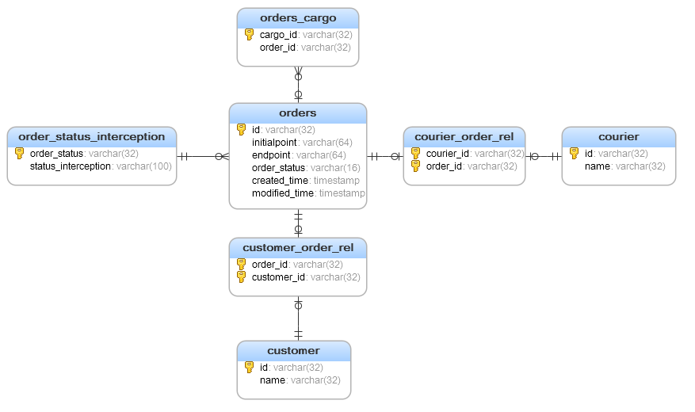
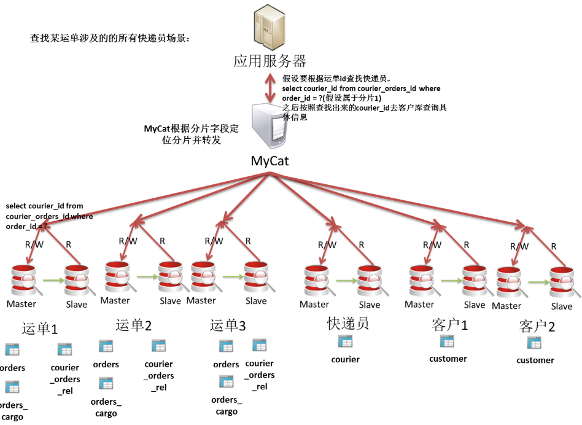

2019-09-05

## 使用 -- 业务场景

### 业务场景
1. 表
    - 客户 完成 下单
    - 快递员 接受 并更新运单状态
    - 客户随时查看运单状态
    - 一个快递 有 多个子母件
    - 标记运单的状态
    - 运单状态的解释和含义 保存到 运单状态字典中
2. 图
    
    

3. 拆分
    - 先 垂直拆分
        - 运单库(单表 2000TPS, 6000W数据)
        - 快递员库(单表 1500TPS, 100W数据)
        - 客户库(单表 1500TPS, 1000W数据)
    - 再 水平
        - 每个mysql 数据库单表不能超过 2000W 数据, < 1000TPS
        - 运单库--3片, 客户库--2片    

### 分片表
1. order
    - 分片
        - table name="orders" primaryKey="id" dataNode="test$1-2" rule="mod-long"
        - 用 mod-long的规则根据主键 id 将运单表 orders 分割到 test1, test2
    - 请求
        - select * from orders where id = 1;
            - 此请求只会发送到一个 节点
        - select * from orders where id < 100 and id > 0
            - 根据分片规则计算两个边界值, 请求发送到对应的节点, **合并每个分片的结果** 
        - select * from orders where others = 1;
            - 非分片查询, **发送到所有分片**, 合并结果 

### 非分片表(小表)
1. courier(快递员)
    - table name="courier" primaryKey="id" dataNode="test3" 

### ER表
1. **子表的记录于所关联的父表记录存放在同一个数据分片上**, 子表依赖父表, **通过表分组 保证数据 join 不会出现跨库操作**

### 全局表
1. 常为 字典表
    - 通过数据冗余来解决这类表的join
        - 所有的分片都有一份数据拷贝

### 如何分布表
1. orders 和 orders_cargo(子母件表) 按照对应键 形成 表分组
2. 快递员和运单是 多对多 关系, 客户对于运单也是 多对多的关系
    - 场景
        - 快递员查看自己所有运单
        - 客户查看自己所有运单
    - 方案
        - 将快递和快递员, 快递和客户 形成关系表, 公共表
            - 但是 关系表的更新会很频繁, 每更新一次关系表都要在每个每个分片上更新一次 --> 性能 可靠性
         - 作为运单的子表
            - 查找一个运单涉及到的快递员和客户 就比较简单   
                -
                
            
            - 快递员查询 自己所有运单的场景 就比较慢, 请求需要发送到所有分片
        - 做为快递员的子表
            - 同样的, 查找一个运单涉及到的快递员, 就需要扫描快递员表的所有分片
        - 将 这种关系表 同时作为 运单和快递员的子表
            - 需要自己保证 双写一致性
        
### 如果从快递员出发去查找以及从运单出发去查找的业务压力差不多大的话
1. 采用关系表同时作为运单和客户的子表
2. 快递员 和 运单的业务独立 
3. 每个业务自己去 维护自己的关系表
4. **通过消息队列来保持关系表的一致性**      

### 分区规则
1. 哈希取模
    - 分片个数最好是 2的n次方
    - 记录平均分布(ID自动生成的时候), 压力平均分布
    - 扩容很难, 基本很难迁移数据
2. 路由约定
    - 自定义 主键的 映射分区库
    - 扩展灵活
    - 数据容易倾斜, 扩容不灵活, 因为是 自定义, 说明分片键是少量的, 可能很难是常用字段
3. 范围路由约定
    - 分片字段在 xx-xxx 可以分片到某个分区
    - 需要保证每个 每个肺分片数据稳定
    - 需要 配合 id 生成器, 如果是顺序递增会出现 压力集中在一个分片上的场景
4. 哈希范围约定
    - 举例
        - 0-15=0
        - 16-31=1
        - 32-47=2
    - 某种程度上减轻 扩容的 压力
4. 全局序列号
    - 通过 mycat 来生成全局唯一序列号, mycat 就不再是无状态的
    - 很难做 集群
    - 可以使用外部组件 -- Zookeeper
     
### 业务分析和分表
1. 运单表根据 运单号做 哈希取模
    - 运单子母表作为运单表的子表 
    - 快递员运单关系表
    - 客户运单关系表
2. 快递员改动不大, 很少出现和快递员 join 的情况, 作为 非分片表
3. 客户表根据 id 哈希取模
4. 运单状态枚举表, 公共表
         
            