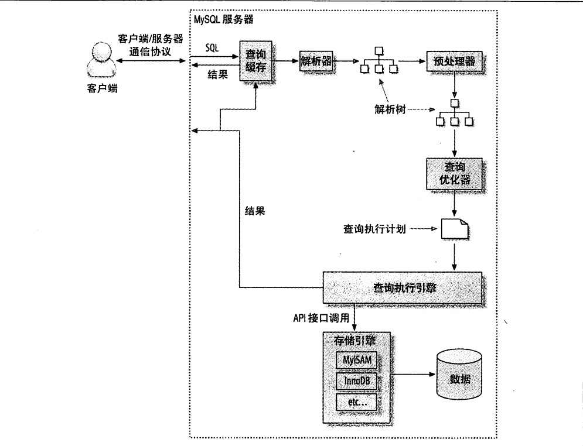

2018-03-22
## 查询性能优化

### 一次查询涉及到的子任务
1. client-server 网络IO
2. 服务器解析 CPU
3. 生成执行计划 CPU
4. 执行 本地IO, 锁
5. 返回客户端 网络IO

### 三项优化
1. 查询优化
2. 索引优化
3. 库表结构优化

### 优化数据访问
1. 查询不需要的记录
    - Limit
2. 多表关联返回全部列
    - 只取需要的列
3. 总是取出全部列
    - 有坏处
    - 有好处
4. 重复查询
    - 缓存
1. 查询需要扫描大量数据, 但只返回少数的行, 优化技巧:
    - 使用索引覆盖扫描, 在所有需要的列都在到索引中去
    - 改变库表的表结构. eg:使用单独的汇总表
    - 重写这个复杂的查询, 让Mysql优化器已更优化的方式执行查询

### 访问(扫描)类型
1. 扫描表
2. 扫描索引
3. 范围访问
4. 单值访问
    
### 重构查询方式
1. 一个复杂查询 还是 多个简单查询
2. 切分查询
3. 分解关联查询
    - 让缓存的效率更高: 让应用程序方便缓存单表查询的结果
    - 分解后, 执行单个查询减少锁的竞争
    - 在应用层做关联, 更容易对数据库进行拆分, 更容易做到高性能和可扩展
    - 提高本身的查询效率
    - 减少冗余记录的查询
    
    
### 查询执行的基础
       

1. 客户端发送一条查询给服务器
2. 检查缓存, 命中缓存直接返回, 没有进行下一步
3. 服务器进行sql解析, 预处理, **再由优化器生成对应的执行计划**  
4. Mysql个根据执行计划, 调用存储引擎的API执行查询
5. 返回结果给客户端

### Mysql 客户端/服务器 通信协议
1. "半双工":同一时刻, 要么 server-->client, 要么 client--> server
2. 当查询语句很长的时候 , 参数max_allowed_packet 就很重要了
3. 必要的时候在查询中加入LIMIT

