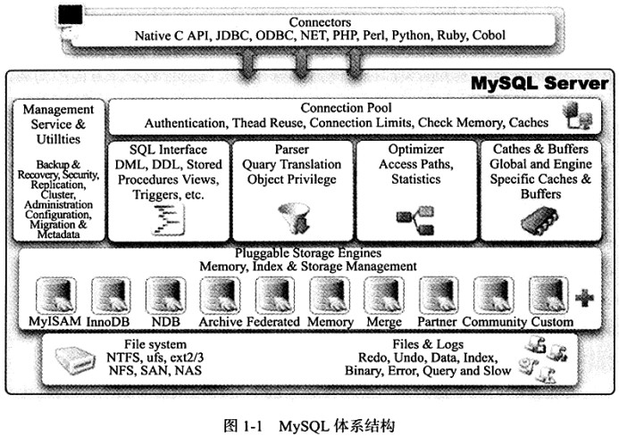
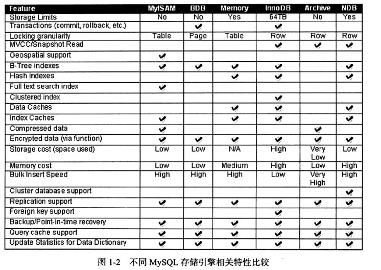

2019-01-23

## Mysql 体系结构和存储引擎

### 安装
1. https://www.cnblogs.com/wangmingshun/p/7710483.html

### 数据库与实例
1. 数据库
    - 物理操作系统文件或其他形式文件类型的集合
2. 实例
    - Mysql 数据库由后台线程以及一个共享内存区组成
    - 数据库实例才是真正用于操作数据库文件的
3. 配置文件
    - 启动需要
    - /etc/my.cnf --> /etc/mysql/my.cnf --> /usr/local/mysql/etc/my.cnf --> ~/.my.cnf
    - 会有默认参数设置启动实例   
    
### Mysql 体系结构

1. 连接池组件
2. 管理服务和工具组件
3. Sql 接口组件
4. 查询分析器组件
5. 优化器组件
6. 缓存组件
7. 插件式存储引擎
    - **基于表 而不是 基于数据库**
    - 提供一系列标准的管理和服务支持, 这些标准和存储引擎本身无关
8. 物理文件 

### Mysql 存储引擎
1. InnoDB 存储引擎z
    - 事务
    - 行锁设计
    - **支持全文索引**
    - 支持外键
    - 读不产生锁
    - MVCC
        - 高并发性
    - 4种隔离级别, 默认 repeatable
    - next-key-locking(间隙锁) 避免幻读
    - 插入缓冲(insert buffer), 二次写(double write), 自适应哈希索引(adaptive hash index), 预读(read ahead)
    - 聚集
        - 数据存储采用 聚集 的方式, 每个表的存储都是按照主键的顺序进行存放
        - 如果没有显式的定义指定主键,  为每一行生成一个 6字节的 ROWID, 作为主键
2. MyISAM 存储引擎
    - 不支持事务, 不支持表锁设计
    - 支持全文索引
    - 缓冲池值缓存索引文件, 而不缓存数据文件
    - 由 MYD 和 MYI 组成
        - MYD: 数据文件
        - MYI: 索引文件
3. NDB 引擎
    - 集群存储引擎, 
    - share nothing 集群结构
    - 数据全部放在内存中(5.1之后非索引数据放在磁盘)
    - JOIN在数据库层完成, 不在存储引擎完成
        - 复杂的操作需要巨大的网络开销
4. Memory 引擎
    - 表中的数据存入内存中, 数据路重启或者崩溃, 表中数据消失
    - **存储临时数据的临时表**, 以及数据仓库的维度表
    - **默认使用 哈希索引**
5. Archive 引擎
    - **只支持 Insert Select 操作**
    - 5.1 开始 支持索引
    - 使用 zlib 算法将数据行(row) 进行压缩后存储, 适合存储归档数据:日志信息
    - 使用行锁 实现高并发的插入
    - 不是 事务安全的
6. Maria 引擎
    - 支持缓存数据和索引文件
    - 行锁设计
    - MVCC
    - 事务和非事务安全的选项
    - 更好的 BLOB 字符类型的处理性能
7. 比较
    - 
    
    
    