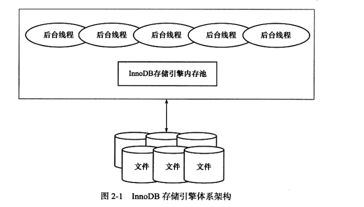

2019-01-24

## InnoDB 存储引擎

### InnoDB 体系结构

### 后台线程
1. 作用
    - 主要负责 刷新内存池中的数据, 保证缓冲池中内存缓存的是**最近的数据**
    - **将已修改的文件刷新到磁盘**
    - 保证在数据库发生异常的情况下 InnoDB 能恢复到正常的状态
2. Master Thread
    - 将缓冲池中的数据**异步刷新到磁盘**, 保证数据一致性
    - 脏页的刷新, 合并插入缓冲(Insert Buffer)
    - Undo 页的回收
3. IO Thread
    - AIO
    - InnoDB 1.0之前 4个IO Thread
        - write
        - read
        - insert buffer
        - log
    - 1.0.x开始
        - read, write 增大到4个
        - innodb_read_io_threads, innodb_write_io_threads 配置
    - Purge Thread
        - 事务被提交后, 其所使用的 undolog 可能不需要, 需要 PargeThread 回收已经使用并分配的 undo 页
        - Innodb 1.1 开始, purge 操作可以在单独的线程中进行
        - innodb_purge_thread=1 启用
    - Purge Cleaner Thread
        - Innodb 1.2.x
        - 将之前版本中脏页的刷新操作都放入到单独的线程中完成

### 内存
1. 缓冲池
    - Innodb 基于磁盘存储, 将其中的记录按照页的方式进行管理
    - 读取页 <--> 缓冲池 <-->磁盘
    - 修改操作
        - 先修改缓冲池中的页, 再以一定的频率刷新到磁盘上
        - Checkpoint 机制
    - innodb_buffer_pool_size(byte)
    - 缓存的数据页类型
        - 索引页
        - 数据页
        - undo页
        - 插入缓冲
        - 自适应哈希索引
        - Innodb 存储的锁信息
        - 数据字典信息
    - 多个缓冲池实例
        - innodb 1.0.x
        - 每个页根据哈希值平均分配到不同的缓冲池, 减少资源竞争, 提高并发能力
2. LRU List, Free Lis,  Flush List(内存管理) 
    - 缓冲池通过 LRU 算法进行管理
    - 当缓冲池无法存放新读取到的页时, 首先释放LRU列表中尾端的页
    - 页 默认大小 **16KB**
    - midpoint insertion strategy
        - 新读取到的页不直接放入LRU列表的首部
        - 放入列表的 midpoint 位置
        - innodb_old_blocks_pct 指定 是一个 百分比
        - 默认 3/8处(列表尾端的37%)
        - midpoint之后的 old列表 
        - midpoint之前的 new 列表
        - innodb_old_blocks_time
            - **表示页读取到mid位置后需要等待多久才会被加入到LRU列表的热端**
3. 脏页
    - 在LRU列表中的页被修改后(缓冲池中的页和磁盘上的页的数据不一致)
    - checkpoint 机制刷新回磁盘
    - Flush 列表中的页就是 脏页列表
    - 脏页即存在与 Flush  列表中, 也可能存在于 LRU 列表中
4. 重做日志缓冲(redo log buffer)
    - 先将重做日志信息先放入这个缓冲区, 然后按照一定的频率将其刷新到重做日志文件
        - Master Thread 每一秒将重做日志缓冲刷新到重做日志文件
        - 每个事物提交的时会...
        - 当重做日志缓冲池的剩余空间小于1/2...
        
### CheckPoint技术
1. **为了避免发生数据丢失的问题, 事务数据库系统普遍采用 WriteAhead Log 策略, 当事务提交的时候, 先写重做日志, 在修改页** 
2. **将缓冲池中的脏页刷会磁盘**
2. CheckPoint需要解决的问题
    - 缩短数据库的恢复时间
        - 当数据库宕机的时候, 不需要重做所有日志, 只需要对 CheckPoint 后的重做日志进行恢复
    - 缓冲池不够用时, 将脏页刷新到磁盘
        - 根据LRU算法移除最近最少使用的页, 如果是脏页, 需要强制执行 CheckPoint
    - 重做日志不可用时, 刷新脏页
3. 两种 CheckPoint
    - Sharp CheckPoint
        - 在数据库关闭的时候 将所有的脏页刷新回磁盘
        - 默认的工作方式 innodb_fast_shutdown = 1
    - Fuzzy CheckPoint
        - Master Thread CheckPoint
            - 以每秒或每十秒的速度从缓冲池的脏页列表中刷新一定比例的页回磁盘
            - 异步
        - FlUSH_LRU_LIST CheckPoint
            - 保证足够的空闲页
            - innodb 移除 LRU 尾端的页如果有脏页, 会触发 CheckPoint
        - Async/Sync Flush CheckPoint
            - 重做日志不可用, 强制将一些脏页刷新回磁盘
            - redo_lsn, checkpoint_lsn
            - **保证重做日志的循环使用的可用性**
        - Dirty Page too much CheckPoint
    
### Master Thread 工作方式
1. TODO

### Innodb 关键特性
1. 插入缓冲(insert buffer)
    - **物理页的一个组成部分**
    - 要求
        - 索引是辅助索引(Secondary index)
            - 插入聚簇索引一般都是顺序的
        - 索引不唯一
            - 在插入缓冲中, 数据库不去查询索引页来判断插入的记录的唯一性
    - Change Buffer
        - TODO
    - 内部实现
        - B+Tree
        - TODO
    - Merge Insert Buffer
        - 合并到真正的辅助索引中
        - TODO
2. 二次写(double write)
    - Innodb 数据页的可靠性
    - 当数据库宕机时,  一个页只写入表中一部分 --> 部分写失效
        - 可以重做日志恢复
            - 如果页本身发生了损坏, 重做没有意义
        - **需要页的副本, 在写入失效发生时, 先通过页的副本来还原该页, 在进行重做** --> 两次写
3. 自适应哈希索引(adaptive hash index)
    - **Innodb 自动根据访问的频率和模式自动的为某些热点页建立哈希索引**
4. 异步IO(Async IO)
5. 刷新邻接页(Flush Neighbor Page)
    - **刷新脏页时, Innodb 在检测到该页所在区(extent) 的所有页, 如果是脏页, 一起刷新**