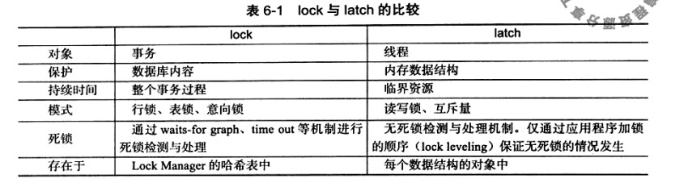

2019-02-18

## 锁

### 为什么使用锁
1. 支持对共享资源的并发访问, 保证数据的完整性和一致性

### latch lock
1. latch
    - 轻量级锁
    - mutex(互斥量)
    - rwlock(读写锁)
    - 保证对临界资源的并发访问的正确性, **一般没有 死锁检测 的机制**
2. lock
    - 用来锁定数据库中的对象
    - 一般 lock 仅在 commit/rollback 之后释放
    - 死锁检测机制
3. 比较
    
    
### Innodb 中的 锁
1. 类型(行级锁)
    - 共享锁(S lock): 允许事务读取一行数据
    - 排它锁(X lock): 允许事务删除或者更新一条数据
    - S 锁仅和 S 锁兼容
2. 意向锁
    - InnoDB 支持多粒度锁（multiple granularity locking），**它允许行级锁与表级锁共存，而意向锁就是其中的一种表锁**
    - **意向锁是一种不与行级锁冲突表级锁**
    - 类型
        - 意向共享锁（intention shared lock, IS）：事务有意向对表中的某些行加共享锁（S锁）
        - 意向排他锁（intention exclusive lock, IX）：事务有意向对表中的某些行加排他锁（X锁）
        - 意向锁是有数据引擎自己维护的，用户无法手动操作意向锁
        - 在为数据行加共享 / 排他锁之前，InooDB 会先获取该数据行所在在数据表的对应意向锁。
    - 意向锁要解决的问题
        - **其他任务在锁定该表前不必检查各个页或行锁，而只需检查表上的意向锁**
    - 意向锁的兼容互斥性
        - 意向锁之间是互相兼容的
    - **它会与普通的 表 排他 / 表 共享锁互斥**
    - 总结
        - InnoDB 支持多粒度锁，特定场景下，行级锁可以与表级锁共存。
        - 意向锁之间互不排斥，但除了 IS 与 S 兼容外，意向锁会与 共享锁 / 排他锁 互斥。
        - IX，IS是表级锁，不会和行级的X，S锁发生冲突。只会和表级的X，S发生冲突。
        - 意向锁在保证并发性的前提下，实现了行锁和表锁共存且满足事务隔离性的要求。
3. 一致性非锁定读(consistent nonlocking read)
    - innodb 通过多版本控制的方式来读取当前执行时间数据库中行的数据
    - 非锁定读
        - 不需要等待访问的行上的 X锁 释放, 
        - 快照数据是该行之前版本的数据, 由 undo 段来完成    
    - mvcc
        - 一个行记录可能有不止一个快照数据
    - Read Committed
        - 总是读取被锁定行的最新一份快照数据
        - 脏读
        - 违反隔离性(I)
    - Repeatable Read
        - 总是读取事务开始时的行数据版本
4. 一致性锁定读
    - 语句
        - select .. for update
            - X锁
        - select .. lock in share mode
            - S锁
    - 不影响 一致性非锁定读
5. 自增长和锁
    - 每一个含有自增长值的表都有一个自增长计数器
    - 需要锁
        - Auto-inc locking 
        - 保证自增的顺序
        - 不在一个事务完成后才释放, 在完成对自增长值插入的sql语句后立刻释放
        - 但是 事务任然要等待前一个插入的完成
    - 5.1.22 开始, 轻量互斥量
        - TODO
6. 外键和锁
    - TODO
    
### 锁的算法
1. 行锁的算法
    - Record Lock: 单个行记录上的锁
    - Gap Lock: 间隙锁, 锁定一个范围, 但不包括记录本身
    - Next-Key Lock: Gap lock + Record Lock 锁定一个范围, 并且锁定记录本身