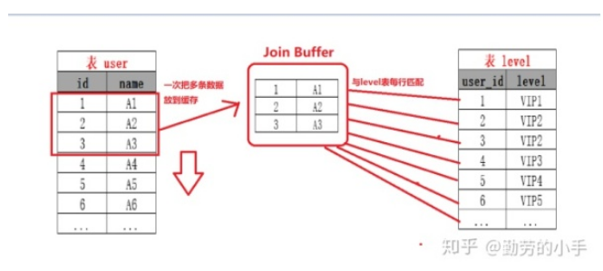

2019-08-01

## JOIN

### 原理
1. 嵌套for循环

### Simple Nested-Loop Join(简单嵌套循环连接)
1. 双层for嵌套, 通过循环外层表的行数据, **逐个与内层表的所有行数据** 进行比较
2. 特点
    - 简单粗暴 容易理解
    - O(n^2)

### Index Nested-Loop Join(索引嵌套循环连接)
1. 减少内层表数据的匹配次数, 避免内层的全表扫描
2. 要求 匹配的字段必须建立索引

### Block Nested-Loop Join（缓存块嵌套循环连接）
1. 减少外层表的循环次数
2. 一次缓存外层表的多条数据, 缓存到 join buffer, 然后批量和内层表的数据进行匹配
3. 当我们不使用Index Nested-Loop Join的时候，默认使用的是Block Nested-Loop Join。

### join 优化思路 
1. 永远用小表驱动大表 --> 减少外循环次数
2. 为匹配的条件创建索引 --> 减少内层循环次数
3. 增大 join buffer size 的大小 --> 增加一次缓存的数据行, 减少 外循环次数
4. 减少不必要的字段查询 --> 字段越少 join buffer 缓存数据越多, 减少更多的 外循环次数