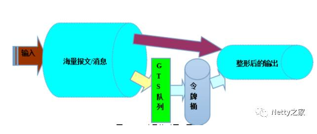

2019-08-26

## 发送太快导致发送端 内存溢出

### 发送端有发送buffer
1. outboundBuffer.addMessage(msg, promise)
2. **无界队列**

### 解决
1. 流控
2. 高水位
    - **当发送队列待发送的字节数组达到高水位上限时，对应的Channle就变为不可写状态：**
    - **达到高水位之后，Netty仅仅会发送一个Channle状态位变更事件通知，并不会阻止用户继续发送消息**
    - 自己设置高水位线, 达到之后直接返回错误
        - ctx.channel().config().setWriteBufferHighWaterMark(10 * 1024 * 1024)
        - ctx.channel().isWritable()
3. 初始化的时候在链路创建时
    - option(ChannelOption.WRITE_BUFFER_HIGH_WATER_MARK, 10 * 1024 * 1024)
    
### 流量整形

1. 原理: 令牌桶