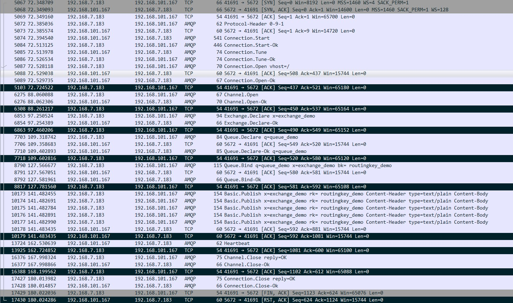
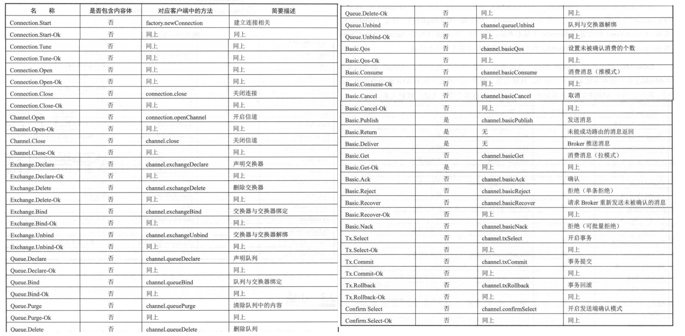

2018-08-28

## 入门

### 相关概念
1. Producer
2. Consumer
3. Broker
    - 消息中间件的服务节点
    - rabbitMQ服务器
4. Queue
    - 消息临时存储位置
    - 多个消费者订阅同一个队列
        - 队列的消息会被平均分摊(Round-Robin 轮询)
        
### 交换机类型
1. fanout
    - 所有发送到这个交换机的信息**路由到所有与该交换机绑定的队列**
2. direct
    - 把消息路由到BindingKey 和 RoutingKey完全匹配的队列中
3. topic
    - RoutingKey BindingKey 都是一个点号 "." 分割的字符串
    - BindingKey 可以使用 * # 用作模糊匹配
    - * 匹配一个单词, # 匹配多个或者零个单词
4. headers
    
### Connection Channel
1. Connection
    - TCP连接
2. Channel
    - AMQP 信道
    - 建立在Connection上的虚拟连接
    - 类似 NIO, Reactor
    - 当信道本身流量很大的时候, 多个信道使用同一个Connetion, 就会面临性能瓶颈
    
### AMQP协议
1. Module Layer
    - 协议最高层
    - 供客户端调用的命令
        - Queue.Declear
        - Basic.consume
2. Session Layer
    - 中间层
    - 为客户端与服务器之间通行提供可靠性同步机制以及错误处理
3. Transport Layer
    - 最高层
    - 传输二进制数据流, 帧的处理, 信道复用, 错误检测, 数据表示
4. 总结
    - 就是一个通信协议
    - 应用层协议
    - 类似 HTTP

### 生产者流转过程

### 消费者流转过程
x

### AMQP 命令

