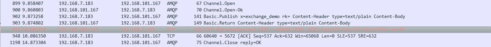
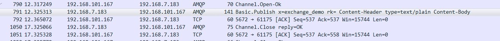

2018-08-29

## 进阶

### 消息何去何从
1. mandatory 参数
    - true: 交换器无法根据自身类型以及路由建找到一个符合条件的队列, Basic.return 命令将消息返回给消费者
        - 
        
    - false: 出现上面的情况 , 直接丢弃 
        -
        
2. imrnediate
    - true: 如果交换器在将消息路由到队列时发现队列上并不存在
            任何消费者，那么这条消息将不会存入队列中。当与路由键匹配的所有队列都没有消费者时 ，
            该消息会通过 Basic.Return 返回至生产者。
    - 已去掉对此参数的支持

### 备份交换机
1. args.put("alternate-exchange","exchange-name")
2. channe1.exchangeDec1are( "norma1Exchange" , "direct" , true , fa1se , args)
3. 当消息不能路由到任何与 norma1Exchange 绑定的任何队列上, 就会发送给  备份交换机
3.消息被重新发送到备份交换机时的路由建和生产者发出的路由建是一致的
    - 所以 推荐备份交换机设置为 fanout 属性

### 过期时间(Time to Live)
1. 可以 对消息以及队列 设置 TTL
2. 设置消息的 TTL
    - 通过队列属性设置, 队列中所有的消息都有相同的过期时间
        - channel.queueDeclare("x-message-ttl"), 毫秒
    - 对消息本身进行单独设置
        - channel.basicPublish(build.expiration()), 毫秒
    - **当两个都设置了 TTL, 两者之间较小的值为准**
3. 设置队列的TTL
    -  channel.queueDeclare("x-expires"), 毫秒
    - 自动删除前处于未使用状态的队列
        - 没有任何消费者
        - 没有被重新声明
        - 在过期时间内未调用过 Basic.ack
    
### 死信队列
1. DLX, Dead-Letter-Exchange 死信交换机
2. 当一个消息变成死信, 会被重新发送到 DLX
    - 消息被拒绝 && requeue = false
    - 消息过期
    - 队列达到最大长度
3. 作用
    - 在异常情况下, 消息没有被正确的消费, 被置入死信队列, 后续程序可以消费死信队列来分析系统遇到的问题
    - DLX + TTL --> 延迟队列

### 延时队列
1. 不想让消费者立刻拿到消息, 等待特定时间后, 消费者才可以拿到消息
2. 应用
    - 订单 30min 之内支付, 未按时支付, 订单做异常处理, 
    - 延迟工作

### 优先级队列

### RPC 实现
1. 回调
2. 唯一id

### 持久化
1. 交换机的持久化
2. 队列的持久化
    - 消息的持久化不会内部所存储的消息不会丢失
    - BasicProperties.deliveryMode = 2
    - MessageProperties.Persistent_text_plain 封装了这个特性
3. 消息的持久化
    - 消息的持久化 以及 队列 的持久化要一起设置才有意义
4. 交换机, 队列, 消息 都设置为持久化, 数据就不可以能丢失吗?
    - 可能丢失
    - 丢失情况
        - autoAck = true
        - 消息存入 MQ 之后, 还需要有一段时间才会同步磁盘-- **fsynx**
            - 这段时间发生宕机 重启 , 数据还没有同步磁盘
            - 解决
                - **镜像队列机制**
                - 发送端的事务机制
                - 发送方确认机制

### 生产者确认
1. 发送方无法确定 消息是否已经到达服务器, **解决 消息一定到达服务器**
2. 解决
    - 事务机制
        - AMQP 协议层面提供
        - channel.txSelect
            - 设置当前信道为 事务模式
        - channel.txCommit
        - channel.txRollBack
        - 与数据库的事务机制有 区别
        - 缺点
            - 多了4个步骤
            - 损失性能
            - 一条消息发送之后, 发送端阻塞
    - 发送方确认(publisher confirm)
        - RabbitMQ 提供的改进方案
        - confirm 模式
        - 唯一id, 有序
        - 一次确认多个(id之前)
        - 异步, 
        - 优化
            - 批量 confirm
                - 定期(定量) 
                - 出现超时或者是 Basic.nack 的时候 , 需要将消息重发
            - 异步 confirm
                - 回调
                - 编程复杂
                - 性能最好
                - **做好消息重发机制**
                
### RabbitMQ 消费端
1. 消息分发
    - 同一个队列多个消费者: 轮询分发
    - 问题
        - 无法区分哪些消费者的任务是否繁重
            - 整体性能将由性能最差的消费者决定
            - channel.basicQos(int perfetchCount)
                - **允许信道上的消费者所能保持的最大未确认消息的数量**
                - 类似 TCP/IP 的活动窗口
                - 注意
                    - **对于 拉模式 无效**
2. 消息顺序性
    - 消费者消费的消息 和 发送者的消息顺序是一致的
    - 有很大的局限性
        - 事务回滚
        - publisher confirm 的 补偿机制
        - 消息超时时间 DLX
        - 消费者拒绝消息
        
### basicQos
1. void basicQos(int prefetchSize, int prefetchCount, boolean global)
    - prefetchSize
        - 表示消费者所能未确认消息的总体大小的上线, 单位 B, 
    - prefetchCount
        - 大于 0, 
            - 这个信道需要和各个队列协调以确保发送的消息都没有超过所限定的 prefetchCount 的值
            - 这样会使 RabbitMQ 的性能降低，尤其是这些队列分散在集群中的多个 Broker 节点之中
    - global
        - TODO
        
### 废弃 QueueingConsumer
1. 内部使用 LinkedBlockingQueue, 当无法及时消费, 会造成客户端内存溢出
    - basicQos
2. 不是事件驱动

### 消息传输保证
1. 三个层级
    - At most once: 最多一次, 消息可能会丢失,但不会重复消费
    - At least once: 最少一次, 消息绝不会丢失, 但可能会重复传输
    - Exactly once: 恰好一次, 每条消息肯定会被传输一次 并且 仅传输一次
2. 最少一次
    - 消费生产者需要开启 事务机制 或者 publisher confirm 机制, 确保消息可以可靠的到达RabbitMq
    - Producer 需要配合使用 mandatory 参数 或者 备份交换机来确保消息能够从交换机路由到队列中
    - Exchange 和 queue 持久化
    - Consumer AutoAck = false
3. 最多一次
    - 随意
4. 恰好一次
    - 无法保证
    - Consumer ack, Server 没有收到, 重复消费
    - Producer 没有收到 Server 的返回确认, 消息重发, 消费者 重复消费
    - 去重机制的恰好一次
        - GUID
        - 客户端去重
        - 集中式缓存
        
### vc Kafka
1. https://juejin.im/post/5b32044ef265da59654c3027