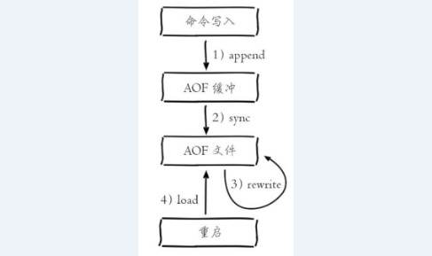
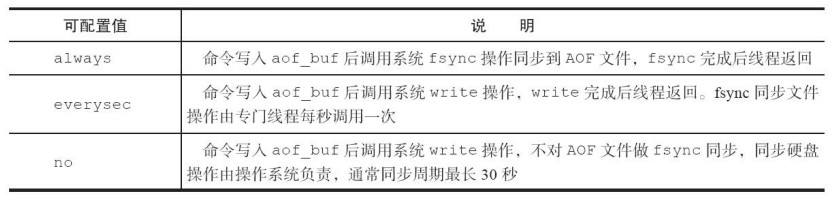

2018-05-03

## 持久化

### RDB(Redis Database)

1. 触发机制
    - 手动 
        - save: 阻塞当前服务器, 不建议使用 
        - bgsave: 当前先线程 fork 操作创建子**进程**, RDB持久化由子进程负责, 阻塞发生在 fork 阶段
    - 自动
        - **使用save相关配置， 如“save m n”。 表示m秒内数据集存在n次修改
          时， 自动触发bgsave**
        - 如果从节点执行全量复制操作， 主节点自动执行bgsave生成RDB文件并发送给从节点
        - 执行debug reload命令重新加载Redis时， 也会自动触发save操作
        - **默认情况下执行shutdown命令时， 如果没有开启AOF持久化功能则
          自动执行bgsave**
2. 保存文件的处理
    - RDB文件保存在dir配置指定的目录下， 文件名通过dbfilename配置指定
    - 当遇到坏盘或磁盘写满等情况时， 可以通过config set dir{newDir}在线
      修改文件路径到可用的磁盘路径， 之后执行bgsave进行磁盘切换， 同样适用
      于AOF持久化文件。
    - Redis默认采用LZF算法对生成的RDB文件做压缩处理， 压缩后的
      文件远远小于内存大小， 默认开启
3. 优缺点
    - 优点
        - RDB是一个紧凑压缩的二进制文件， 代表Redis在某个时间点上的数据
          快照。 非常适用于备份， 全量复制等场景。 比如每6小时执行bgsave备份，
          并把RDB文件拷贝到远程机器或者文件系统中（如hdfs） ， 用于灾难恢复
        - Redis加载RDB恢复数据远远快于AOF的方式
    - 缺点
        - **RDB方式数据没办法做到实时持久化/秒级持久化。 因为bgsave每次运
        行都要执行fork操作创建子进程， 属于重量级操作， 频繁执行成本过高。**
        - RDB文件使用特定二进制格式保存， Redis版本演进过程中有多个格式
          的RDB版本， 存在老版本Redis服务无法兼容新版RDB格式的问题
        - 无法在断电的情况恢复

### AOF(Append only file)
1. **以独立日志的方式记录每次写命令，
   重启时再重新执行AOF文件中的命令达到恢复数据的目的。** AOF的主要作用
   是解决了数据持久化的实时性        
2. 工作流程: 

### AOF 命令写入
1. 采用文本协议格式
    - 文本协议具有很好的兼容性。
    - 开启AOF后， 所有写入命令都包含追加操作， 直接采用协议格式， 避
      免了二次处理开销。
    - 文本协议具有可读性， 方便直接修改和处理。
2. 命令追加到aof_buf中
    - Redis使用单线程响应命令， 如
      果每次写AOF文件命令都直接追加到硬盘， 那么性能完全取决于当前硬盘负
      载
    - 先写入缓冲区aof_buf中， 还有另一个好处， **Redis可以提供多种缓冲区
      同步硬盘的策略， 在性能和安全性方面做出平衡**
### 文件同步

1. write:操作会触发延迟写（delayed write） 机制。 Linux在内核提供页缓
         冲区用来提高硬盘IO性能。 write操作在写入系统缓冲区后直接返回。 同步
         硬盘操作依赖于系统调度机制， 例如： 缓冲区页空间写满或达到特定时间周
         期。 同步文件之前， **如果此时系统故障宕机， 缓冲区内数据将丢失** 
2. fsync: 针对单个文件操作（比如AOF文件） ， 做强制硬盘同步， fsync将
          阻塞直到写入硬盘完成后返回， 保证了数据持久化
          
### 重写机制(AOF重写机制压缩文件体积)

1. 合并命令
2. 删除无效命令
3. 进程内已经超时的数据不在写入文件
4. **子进程将旧的AOF文件 合并到 新的 AOF文件中, 主线程依然接受新的请求, 放入AOF缓冲区, 并根据appendfsync策略同步硬盘, 保证原有的AOF机制有效**
5. 由于fork操作运用写时复制技术， 子进程只能共享fork操作时的内
   存数据。 由于父进程依然响应命令， **Redis使用“AOF重写缓冲区”保存这部
   分新数据， 防止新AOF文件生成期间丢失这部分数据**
6. **父进程把AOF重写缓冲区的数据写入到新的AOF文件。**
5. 新的 AOF文件 覆盖 旧的

### 重启机制

