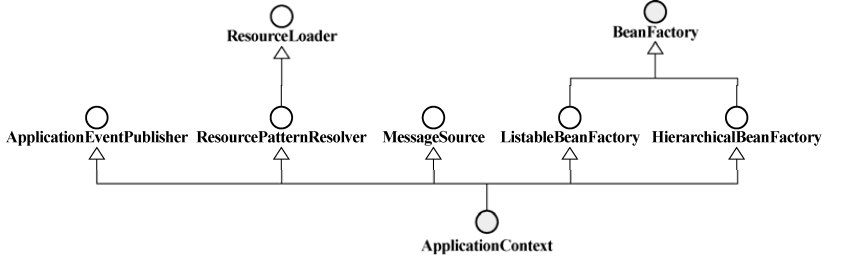
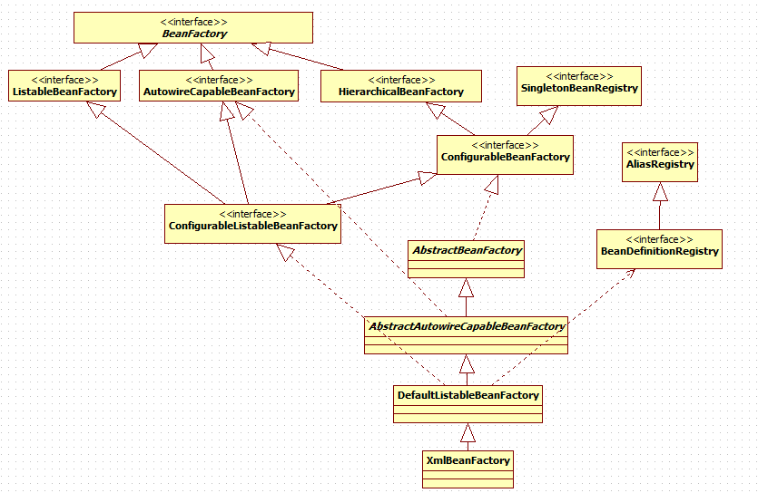

2018-10-09

## BeanFactory

1. 一个容器
2. **负责Bean的注册与管理工作**


### 容器类型
1. BeanFactory 
    - 完整的IOC支持
    - **默认采用延迟初始化策略(lazy-load)**
    - 需要的时候才会初始化 并 注入
2. ApplicationContext
    - 在 BeanFactory 基础上创建
    - **容器启动后, 默认全部初始化完成 并 完成绑定**
3. 关系
    - 
    
### BeanDefinitionRegistry
1. **抽象了 Bean 的注册逻辑**

### BeanFactory 的对象注册和依赖绑定方式
1. 直接编码
2. 外部配置文件
    - Properties
        - PropertiesBeanDefinitionReader
    - Xml
        - XmlBeanDefinitionReader
        - XmlBeanFactory
            - 这个默认不支持 BeanPostProcessor，需要使用ApplicationContext实现如ClassPathXmlApplicationContext
            - **导致 xmlBeanFactory 对 @Autowired 不起作用 **            
3. 注解方式
    - @Component, @Autowired
    - context:component-scan base-package=""
    
### BeanFactory 与 Xml
1. bean的属性
    - default-lazy-init
        - false
    - default-autowire
        - no, byName, byType, constructor
        - no
    - default-dependency-check
        - none, objects, simple, all
        - none
    - default-init-method
    - default-destroy-method
2. scope
    - 声明对象的所处的限定场景 或者是 对象的存活时间
    - Singleton
        - 只有一个
        - 共享同一个
    - prototype
        - **容器接收到该类型的对象的请求的时候**
    - request, session, global session
3. 工厂方法与FactoryBean
    - factoryBean
        - 一个 Bean 而已
        - 这个对象本身是生产 Bean 的工厂

### 容器背后的秘密

1. 过程
    - 启动
        - BeanDefinitionReader
        - BeanDefinition
        - BeanDefinitionRegistry
    - bean 实例化
        - getBean()
        - 注入依赖
        - 回调接口
2. 插手启动的过程
    - BeanFactoryPostProcessor
        - PropertyPlaceholderConfigurer
            - 占位符
            - 数据库连接参数
        - PropertyOverrideConfigurer
            - TODO

### Bean 的一生

1. 提示
    - AbstractBeanFactory.getBean()
    - AbstractAutowireCapableBeanFactory.createBean()
2. 步骤
    - Bean的实例化与 BeanWrapper
        - 实例化方式(策略模式)
            - 反射
                - SimpleInstantiationStrategy
                    -  不支持方法注入的对象实例化
            - CGLIB
                - CglibSubclassingInstantiationStrategy
                    - 继承 SimpleInstantiattionStrategy
                    - 动态生成字节码
                    - 默认方式
                    - beanDefinition.getMethodOverrides().isEmpty() / !bd.hasMethodOverrides()
        - 以 BeanWrapper对构造完成的对象进行包裹, 返回 BeanWrapper 实例
            - 方便惊醒对象的属性设置
            - 反射
    - 各色 Aware 接口
        - **实例化完成并在相关属性以及依赖设置完成之后**
        - 是否实现了以 Aware 命名结尾的接口
            - BeanNameAware
            - BeanClassLoaderAware
            - BeanFactoryAware
                - Prototype
    - BeanPostProcesser
        - vs BeanFactoryPostProcessor
            - BeanPostProcesser 对象实例化阶段
            - BeanFactoryPostProcessor 容器启动阶段
        - **处理容器内所有符合条件的实例化后的对象实例**
        - 场景
            - 处理标记接口实现类
            - **为当前对象提供代理实现**
    - InitializingBean 与 init-method
        - BeanPostProcesser的后置处理之前
    - DisposableBean 与 destroy-method
        - 回调
        - 常见场景
            - 数据路连接池

### BeanFactory的基本类体系结构（接口为主）
  

### Bean初始化路径
```text
BeanFactory.getBean() --> AbstractBeanFactory.doGetBean() --> cache, parentBeanFactory
--> dependsOn --> AbstractAutowireCapableBeanFactory.createBean() --> AbstractAutowireCapableBeanFactory.doCreateBean()
--> AbstractAutowireCapableBeanFactory.createBeanInstance() --> BeanUtils.instantiateClass() OR CGLIB --> BeanWrapper
--> AbstractAutowireCapableBeanFactory.populateBean() --> AbstractAutowireCapableBeanFactory.initializeBean()
```      
            
            