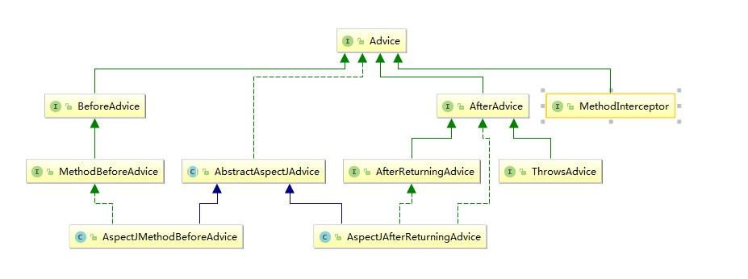
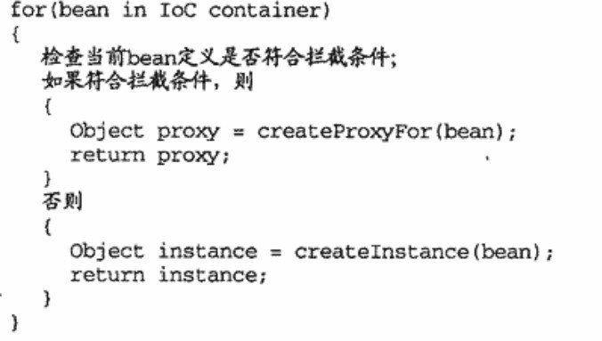

2018-10-11

## Spring AOP 历程
1. 底层实现机制一直没有改变
2. 改变
    - AOP概念实体的表现形式
    - SpringAOP 的使用方式

### Spring2.0之前

1. Pointcut
    - ClassFilter getClassFilter()
        - boolean matches(Class clazz)
        - ClassFilter TRUE = TrueClassFilter.INSTANCE
    - MethodMatcher getMethodMatcher()
        - org.springframework.aop.MethodMatcher#matches(java.lang.reflect.Method, java.lang.Class<?>)
            - isRunTime = false
            - 因为不关心参数, 可以缓存, 提高性能
            - StaticMethodMatcherPointcut
        - org.springframework.aop.MethodMatcher#matches(java.lang.reflect.Method, java.lang.Class<?>, java.lang.Object[])
    - Pointcut TRUE = TruePointcut.INSTANCE
2. Advice
    - 遵循 AOP Alliance 规定的接口
    - per-class 类型
        - 可以在目标对象类的所有实例之间共享
        - 只提供方法拦截功能???, 不会对目标对象类保存任何状态或者添加新的特性
        - 最常接触的类型
        - 类型
            - Before Advice
                - 在相应的 JoinPoint之前执行
                - 可以通过抛出异常来中断流程
                - 系统的资源初始化, 或者是 其他的准备性工作
            - ThrowsAdvice
                - 监控系统特定异常
            - AfterReturningAdvice
                - 当前 Joinpoint 的方法返回值, 方法, 方法参数, 所在的目标对象
                - 适用
                    - 资源清理工作
                    - 相似工作的拦截, 增加其他逻辑
                - 缺点
                    - **无法修改方法的返回值** 
            - Around Advice
                - 完成前面所有Advice能做的事
                - 功能
                    - 系统安全验证和检查
                    - 系统各处的系统检测
                    - 简单的日志记录
                    - 系统附加行为
           - 
            
    - per-instance 类型
        - 不会在目标类所有对象实例之间共享
        - 为不同的实例对象保存他们各自的状态以及相关逻辑
        - 类型
            - Introduction
                - 为目标对象添加新的属性和行为
3. Aspect
    - Advisor
    - PointcutAdvisor 家族
        -
        
        - DefaultPointcutAdvisor
            - 最通用的 PointcutAdvisor 实现
            - DefaultPointcutAdvisor advisor = new DefaultPointcutAdvisor(pointcut, advice)
        - NameMatchMethodPointcutAdvisor
            - 细化后的 DefaultPointcutAdvisor
            - 功能委托给 NameMatchMethodPointcut
        - RegexpMethodPointcutAdvisor
            - 类似
            - 正则表达式的Pointcut
    - Ordered 的作用
        - 多个需要在同一个Joinpointc处执行的Advice逻辑存在优先顺序依赖
        - 如果没有实现这个接口, 那么就会按照声明的顺序, 谁先声明谁在前面
            - 如果全局的异常捕获Advisor在其他异常捕获Advisor之后, 就会导致 其他异常捕获Advisor 抛出的异常无法捕获

### Spring AOP 的织入
1. 织入器 -- ProxyFactory
    - 需要
        - 要对其进行织入的对象
        - 要应用到目标对象的Advisor(Aspect)
    - 对目标类进行基于类的代理(CGLIB)
        - 没有实现任何接口
        - ProxyTargetClass = true
        - optimize = true
    - 本质
        - AopProxy
            - Cglib2AopProxy
            - JdkDynamicAopProxy
                - InvocationHandler

        - 工厂模式
            - AopProxyFactory
                - DefaultAopProxyFactory
                    - AdvisedSupport
                        - ProxyConfig
                            - 生成代理对象的控制信息
                        - Advised
                            - 生成代理对象所需要的必要信息
                                - 目标类
                                - Advice
                                - Advisor
            - ProxyCreatorSupport
                - createAopProxy()
    - 容器中的织入器 - ProxyFactoryBean
        - Proxy + FactoryBean
        - getObject()
            - 返回的都是代理对象Proxy
            - Singleton 返回缓存对象
    - 织入的自动化
        - 建立在 IOC 容器的 BeanPostProcesser
        - 
        
        - **如何判断当前bean是否符合拦截条件**
            - 外部配置文件, Pointcut, Advisor
            - 注解
            - 可用的AutoProxyCreator
                - BeanNameAutoProxyCreator
                    - **将一组拦截器(Advice, Advisor)应用到容器内指定的目标对象**
                - DefaultAdvisorAutoProxyCreator
                    - **自动搜寻容器内的所有Advisor, 根据Advisor提供的拦截信息, 为符合条件的目标对象生成代理对象** 
                    -只对 Advisor 有效
                        - 有 PointCut 筛选目标对象
                        - 有 Advice 获取切面
        - InstantiationAwareBeanPostProcessor
            - **检测到此类型的 BeanPostProcesser, 直接返回此Processor构造的对象返回,** 
            - **短路**

### TargetSource
1. 作用
    - **proxy代理的不是 target, 而是 targetSource**
    - 可以使得每次方法调用的target实例不同
    - 使方法调用变得灵活, 可以扩展需要高级功能
        - targetPool
        - hot swap
2. 实现
    - SingletonTargetSource
        - 最常用
    - PrototypeTargetSource
    - HotSwappableTargetSource
        - 动态替换目标类型类的实现
            - 动态切换数据源
    - CommonsPoolTargetSource
    - ThreadLocalTargetSource
        - 不同线程提供不同的对象
        - ThreadLocal的简单封装