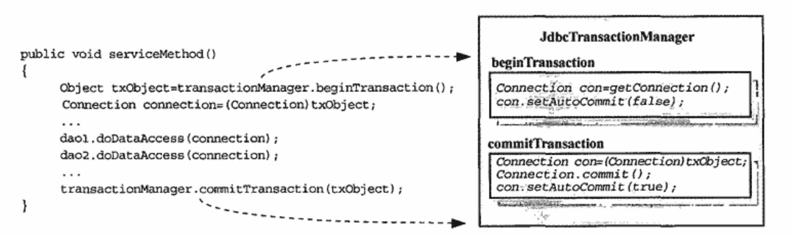
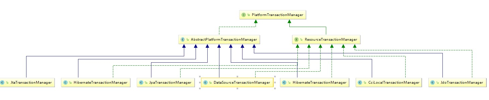

2018-10-21

## Spring 事务架构

### 基本原则
1. **事务管理的关注点和数据访问的关注点相分离**

### 统一过程
1. PlatformTransactionManager
    - 方法
        - rollback
        - getTransaction
        - commit
2. 自己实现 PlatformTransactionManager
    - 多个Dao处于同一个事务
    - 同一个 java.sql.connection
    - connection-pass
        - 
        
        - 问题
            - 事务代码无法和 java.sql.connection 分离
        - 解决
            - 统一的地方获取 connection
            - ThreadLocal
        - 具体实现
            - JdbcTransactionManager
            - 解除它与相应数据访问对象之间通过 java.sql.Connection 的直接耦合
            - 在进行事务控制的时候, 只需要为 Service 对象提供相应的 PlatformTransactionManager 实现类即可
         - 问题:
            - **如何保证 PlatformTransactionManager 的相应方法以正确的顺序被调用**
            - **如果当前数据访问操作不想进行事务管理支持, 是不是就无法获取 Connection 进行数据访问**   
            - Spring-DataSourceUtils

### 事务抽象
1. PlatformTransactionManager
    - 界定事务边界
2. TransactionDefinition
    - 定义事务属性
        - 隔离(Isolation)级别
            - ISOLATION_DEFAULT
            - ISOLATION_READ_COMMITTED
            - ISOLATION_READ_UNCOMMITTED
            - ISOLATION_REPEATABLE_READ
            - ISOLATION_SERIALIZABLE
        - 传播行为
            - PROPAGATION_REQUIRED
            - PROPAGATION_SUPPORTS
            - PROPAGATION_MANDATORY
            - PROPAGATION_REQUIRES_NEW
            - PROPAGATION_NOT_SUPPORTED
            - PROPAGATION_NEVER
            - PROPAGATION_NESTED
        - 超时时间
        - 是否为只读(ReadOnly) 事务
3. TransactionStatus
    - 关闭事务开始到结束的事务状态
    - 大多用于编程式事务
    
### 事务对象
1. transaction Object
    - 当前事务的必要信息, 提供给 PlatformTransactionManager 来决定如何处理事务
    - java.transaction.Transaction
2. TransactionSynchronization
    - 事务处理的回调接口
        - 清理资源
    - javax.transaction.Synchronization
    - org.springframework.transaction.support.TransactionSynchronization
        -提供更加丰富的回调
3. TransactionSynchronizationManager
    - 类似 TransactionSynchronizationRegistry
    - 管理回调接口, 当前事务状态, 具体的事务资源
    - **Connection, Hibernate Session 绑定的目的地**
4. 结构
    -
    
    
### AbstractPlatformTransactionManager
1. 

### PlatformTransactionManager 实现类
1. JtaTransactionManager
    - 全局事务, 分布式事务
    - 对各种JTA提供的分布式事务支持进行统一的封装
    - **最终都为委派给具体的JTA实现来完成**
2. DataSourceTransactionManager
    - 
    

