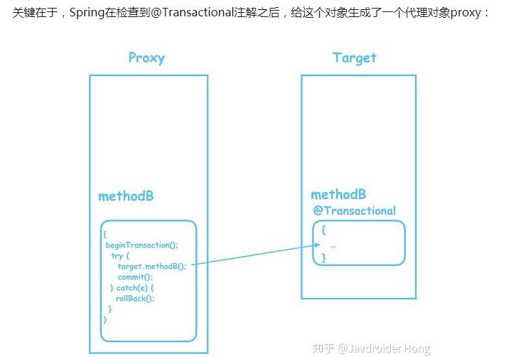
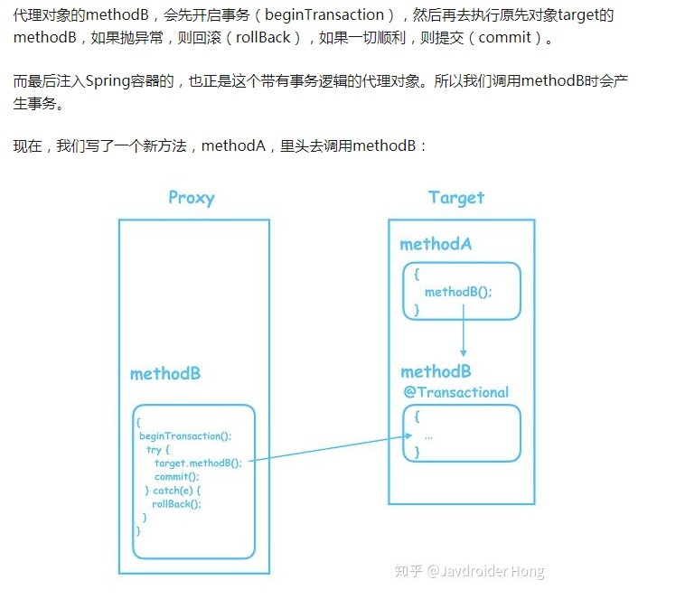
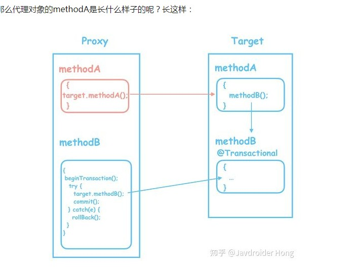

2018-07-02

## @Transactional 源码解析

### Q
1. 注解在非 public方法不起作用
2. 一个没有加@Transactional注解的方法，去调用一个加了@Transactional的方法, 事务不起作用

### 消失的事务
1. 一个没有加@Transactional注解的方法，去调用一个加了@Transactional的方法, 事务不起作用

### 再次学习 20190618
1. 过程
    - 在 Controller 中的方法添加 @Transaction, 
        - 里面两句 jdbcTemplate.update, 第二个update 会报错
            - 没有捕获异常, 第二句update报错
                - 回滚
            - 只捕获 第二个 update 的异常 Exception
                - 不会滚
            - 只捕获 第二个 update 的异常 RunTimeException
                - DataAccessException
                - 不会滚
        - 调用 service 的两个方法, service 只有一个 @Service 注解, 有两个方法 update(name, age), updateAgain(name, age)
            其中, updateAgain(name, age) 会报错
            - 回滚
        - 删除 Controller 中的 @Transaction
            - 不会滚
        - 在 update(name, age) 上添加 @Transaction, 外面分别调用这两个
            - 不会滚
        - 在 update(name, age) 上添加 @Transaction, 然后在 update(name, age) 中调用 updateAgain(name, age)
            - 回滚
        - 在 update(name, age)删除 @Transaction, updateAgain(name, age) 增加 @Transaction 
            然后在 update(name, age) 中调用 updateAgain(name, age)
              - 不回滚
        - update(name, age) 没有 @Transaction , 调用另外一个类的 updateAgain(name, age), 类上有 @Transaction
            - update(name, age) 回滚吗
                - 不会滚
            - updateAgain(name, age) 回滚吗
                - 回滚
        - update(name, age) 有 @Transaction , 调用另外一个类的 updateAgain(name, age), 方法没有 @Transaction
            - **回滚**
            - 需要再次确认, 自己测试是 回滚的
        
            
        
     
