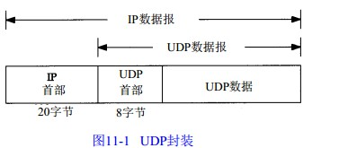

2018-12-04

## UDP: 用户数据报协议

### 概述
1. 面向数据报的运输层协议
2. tcp: 面向流
3. 缺乏可靠性, 
4. MTU, IP数据报分片

### 首部
1. 由于 IP层已经把IP数据报分配给TCP或UDP（根据I P首部中协议字段值），
    - TCP端口号由TCP来查看
    - UDP端口号由UDP来查看
    - 相互独立, 可以是一个端口号
2. UDP长度 = UDP首部(8个字节) + UDP数据的字节长度
    - 最小8byte
    - 冗余
    
### UDP 校验和
1. 覆盖 UDP 首部 和 UDP数据
2. 可选

### IP分片
1. 物理网络层一般要限制每次发送数据帧的最大长度
    - 判断向本地那个接口发送数据(选路)
    - 查询该接口获取其MTU
2. 分片可以发生在发送端主机上, 也可以发送中间路由器
    - 意思是, 也可以发生在目的地(目的地MTU<发送端MTU) ???
3. **重新组装由目的端的IP层来完成**
    - 使分片和重组过程对运输层(TCP/UDP) 透明
4. IP首部
    - 标识字段
        - 唯一
        - 在数据报分片时被复制到每个分片中
        - **标志字段用其中一个比特来表示“更多的片”。除了最后一片外，其他每个组成数据报的片都要把该比特置 1**
        - **片偏移字段指的是该片偏移原始数据报开始处的位置**。
        - **当数据报被分片后，每个片的总长度值要改为该片的长度值**
    
### 最大UDP数据报长度
1. 65536
    - 65536 - 20(IP首部) - 8(UDP首部) = 65507
2. 大多数实现所提供的长度比这个最大值小

    