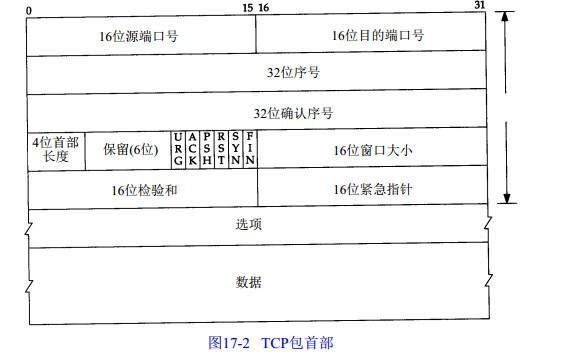

2018-05-17

## TCP
1. 面向连接的, 可靠的字节流服务

### 保证可靠性的方式
1. 应用程序被分割成TCP认为最适合发送的数据块
    - 报文段/段
2. 当TCP发出一个段后, 启动一个定时器, 等待目的端确认收到这个报文段
    - 超时重发
3. 当TCP收到发自TCP连接另一端的数据, 它将发送一个确认
4. TCP保持它首部和数据的校验和
    - 检测数据在传输过程中的任何变化
    - 丢弃或者超时重传
5. 通过IP层来传输, 可能无序
    - TCP重新排序, 然后发给应用层
4. IP数据报会发生重复
    - TCP接收端需要去重
4. 流量控制
    - 接收缓冲区

### TCP首部
1. **TCP.源端口+TCP.目的端端口+源IP地址+目的IP地址--> 唯一确定一个TCP连接**

2. 序号
    - 标识从TCP发端向TCP收端发送的数据字节流
    - 用序号对每个字节进行计数, 到达2^32-1后, 从0开始
3. 确认序号
    - 应当是上次已成功收到数据字节序号加 1
    - 连接的每一端都需要保持每个方向上的传输数据序号
4. 首部长度
    - 首部中32bit的数目
    - 4个字节
    - TCP最多有60字节的首部
5. 6个标志
    - URG: 紧急指针(urgent pointer) 有效
    - ACK: 确认序列有效
    - PSH: **接受方应该尽快将这个报文段交给应用层** 
    - RST: 重新连接
    - SYN: 同步序号用来发起一个连接
    - FIN: 发端完成发送任务
5. 窗口
    - 流量控制
    - 65536
    - 可以按比例变化以提供更大的窗口
4. 可选字段
    - 最长报文大小--MSS(Maximum Segmaet Size)
        - 每个连接方都在通讯的第一阶段(建立链接而设置SYN的阶段)中指明这个选项
        - **指明本段所能接收的最大长度的报文段**
4. 

### 