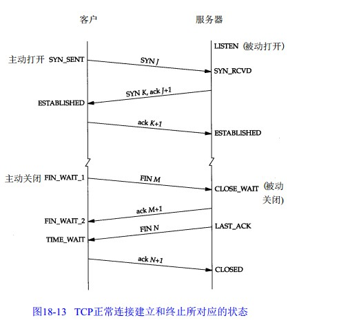
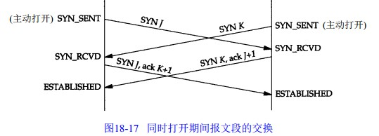
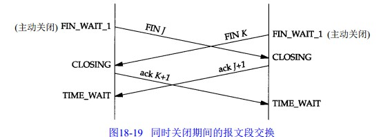

2018-12-06

## TCP的连接与关闭

### 建立连接

### 连接建立的超时

### MSS
1. TCP 发送到另一端的最大块数据的长度
2. 可以不一样
3. 建立连接的时候通告它所期望的 MSS 选项
3. 大小
    - 对于以太网 1460(1500-20tcp-20ip)
4. 不同网络
    - **如果中间网络采用了更小的 MTU, 也会出现分段**
    - **MTU发现机制解决**

### TCP半关闭
1. TCP 提供了连接的一端在结束它的发送后还能接收来自另一端数据的能力
2. shutdown

### TCP状态

### 2MSL等待状态
1. MSL
    - Maximum Segment Lifetime 报文最大生存时间
    - 超过这个时间的报文将被丢弃 
    - RFC793 规定为 2min, 实际中使用 30s, 1min, 2min
2. TTL
3. 2MSL
    - 两倍的MSL
4. TCP--TIME_WAIT
    - 2MSL等待状态
    - 过程
        - 必须在此状态上停留两倍的MSL时间，
        - **等待2MSL时间主要目的是怕最后一个ACK包对方没收到，那么对方在超时后将重发第三次握手的FIN包**，
        - 主动关闭端接到重发的FIN包后可以再发一个ACK应答包。
        - **在TIME_WAIT状态时两端的端口不能使用，要等到2MSL时间结束才可继续使用**。
        - 当连接处于2MSL等待阶段时任何迟到的报文段都将被丢弃。
        - 不过在实际应用中可以通过设置SO_REUSEADDR选项达到不必等待2MSL时间结束再使用此端口。

### 平静时间
1. RFC 793指出TCP在重启动后的MSL秒内不能建立任何连接

### FIN_WAIT_2
1. 主动关闭端已发送FIN, 并且另一端也已经确认
2. 主动关闭方不再发送数据
2. 主动关闭方仍然可以接收数据
3. 此时为 TCP 半关闭状态

### RST
1. 作用
    - 标示复位、用来异常的关闭连接。
        - 发送RST关闭连接时, 不必等缓冲区的包都发出去, 直接丢弃缓冲区的包, 发送RST
        - 而接收端收到 RST包后, 也不必发送ACK来确认
2. when
    - 无论何时一个报文段发往基准的连接出现错误, tcp都会发出一个复位报文段
        - 建立连接的SYN到达某端口，但是该端口上没有正在 监听的服务
        - TCP收到了一个根本不存在的连接上的分节。
        - 请求超时。 使用setsockopt的SO_RCVTIMEO选项设置recv的超时时间。接收数据超时时，会发送RST包。

### 基准的连接 referenced connection
1. 目的ip和目的端口以及源ip和源ip地址号指明的连接

### 检测半打开连接
1. 含义
    - 一方以及关闭连接或异常终止连接而另一方不知道 
2. keepalive
    - TODO

### 同时打开
1. 两个应用程序同时彼此执行主动打开的情况, 每一方必须发送一个SYN, 且这些SYN必须传递给对方
2. how
    - 需要每一方使用一个对方谁知的端口作为本地端口
3. 情形
    - 还是一条连接
    - 每一端既是客户端 也是 服务端
4. 实现
    - 同时启动
    - 较长的往返时间

### 同时关闭

### TCP服务器设计
1. 当客户端连接请求是, 服务器如何处理端口
2. 多个请求同时到达会发生什么情况
1. TCP服务器端口号
    - listen
        - 只有处于这个状态的进程可以接收新的请求, 并不接收数据报文段
    - Established
        - 处于这个状态的进程不能接收SYN报文段
2. 呼入连接请求队列
    - 一个并发服务器调用一个新的进程来处理客户端请求
        - **服务器应该始终准备处理下一个呼入的连接请求**
    - 那么服务器正忙的时候, 如何处理新的连接请求
        - 等待请求连接的一方有一个固定长度的连接请求, 
            - 该队列的连接已被TCP接受(三次握手完成), 但还未被应用层接受
            - 应用层接受连接时, 将其从该队列中移除
        - 应用层应指明该队列的最大长度
            - 积压值(backlog)
            - 0-5
            - 对系统所允许的最大连接数, 并发服务器所能并发处理的客户数无关
        - 当一个连接请求(SYN)到达时, TCP使用一个算法, 根据当前队列中的连接数来确定是否接受这个连接
        - 对于新的连接请求, 如果队列未满, TCP模块将对SYN进行确认并完成连接的建立
            - 应用层只有在第三次握手完成后再回知道这个连接, 但客户端不知道这个请求, 只知道服务器进程已经准备好接受数据了
                如果发生这种情况, 服务器TCP仅将接受的数据放入缓冲队列中
        - 队列已满, TCP不理会接收到的SYN, 也不发会任何报文段(RST)